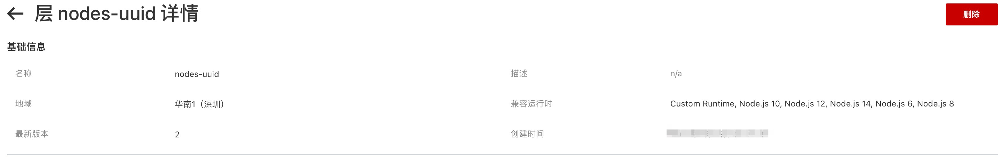
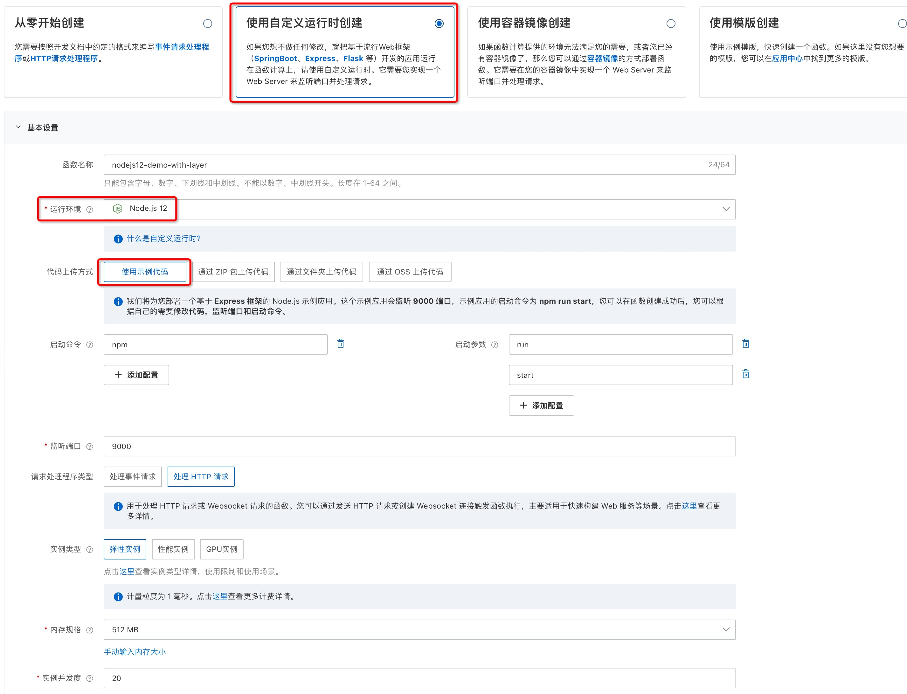
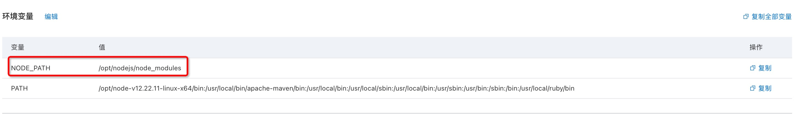

# 在 Custom Runtime(Nodejs) 语言中引用层中的依赖
本示例为您展示了如何在 Custom Runtime(Nodejs) 中引用层中的 uuid 模块。

## 准备工作
已经创建好的层，层中包含 uuid 库，创建层时需要选择“自定义”运行时作为兼容运行时.

可参考以下文档构建层
https://help.aliyun.com/document_detail/193057.html 

例如：


## 操作步骤

#### 1. 使用Nodejs自定义运行时创建函数

- 运行环境选择 "自定义运行时-Nodejs" (层中的依赖要和该python版本匹配)
- 使用示例代码创建
- 选择 HTTP 请求处理程序类型



#### 2. 配置层
在“函数配置”页面，将已创建好的层配置到函数中


#### 3. 添加模块搜索路径
按照文档构建的层，其依赖库在`/opt/nodejs/node_modules`目录下；需要将该目录添加到模块搜索路径中。

在“函数配置”页面设置环境变量 `NODE_PATH=/opt/nodejs/node_modules`,如下所示



#### 4. 在代码中引用 `uuid` 模块
修改示例代码中的 `index.js` 文件，引用 `uuid` 模块测试。

```js
const express = require('express')
const app = express()
const port = 9000

app.get('/', (req, res) => {
  const {v4: uuidv4} = require('uuid');
  res.send(uuidv4())
})

app.listen(port, () => {
  console.log(`Example app listening on port ${port}`)
})
```

#### 5. 测试函数

返回结果如下所示
