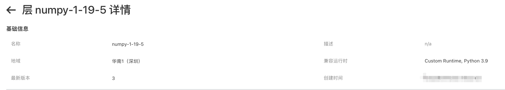
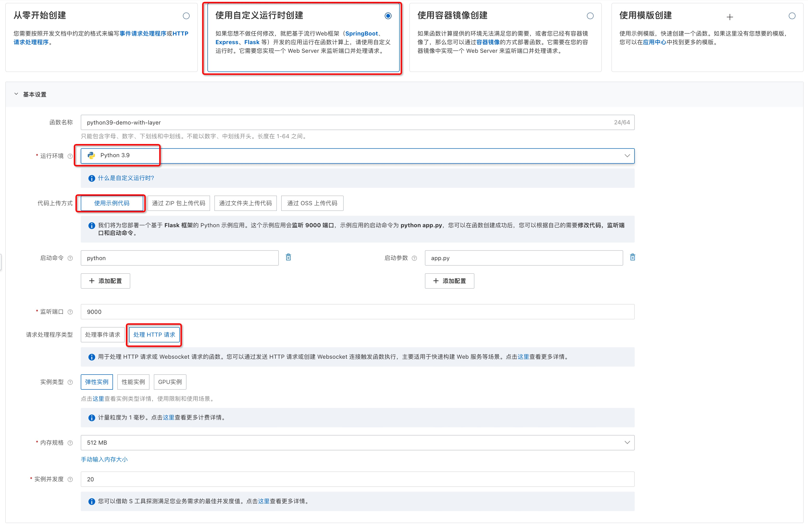
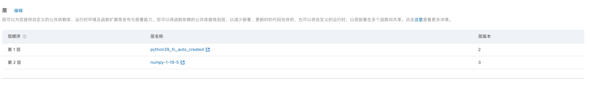
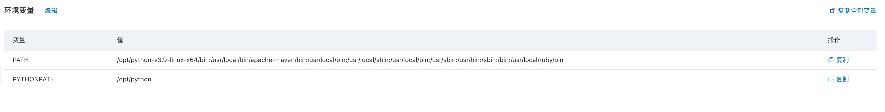
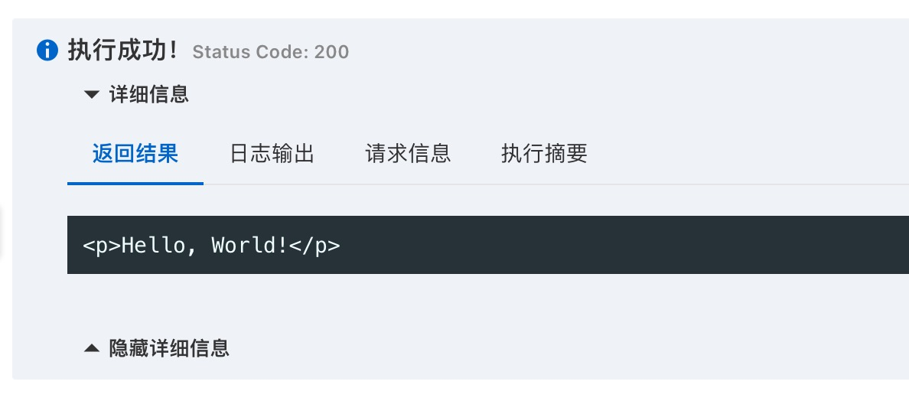

# 在 Custom Runtime(Python) 语言中引用层中的依赖
本示例为您展示了如何在 Custom Runtime(Python) 中引用层中的 numpy 模块。

## 准备工作
已经创建好的层，层中包含 numpy 库，创建层时需要选择“自定义”运行时作为兼容运行时.

可参考以下文档构建层
https://help.aliyun.com/document_detail/193057.html 

例如：


## 操作步骤

#### 1. 使用Python自定义运行时创建函数

- 运行环境选择 Python3.9 (层中的依赖要和该python版本匹配)
- 使用示例代码创建
- 选择 HTTP 请求处理程序类型



#### 2. 配置层
在“函数配置”页面，将已创建好的层配置到函数中


#### 3. 添加模块搜索路径
按照文档构建的层，其依赖库在`/opt/python`目录下；需要将该目录添加到模块搜索路径中。

- 方法一、可以在代码中使用 `sys.path.append('/opt/python')` 方式添加搜索路径。
修改示例代码中的 `app.py` 文件
    ```python
    # app.py
    from flask import Flask

    # 必须在 import numpy 前执行 
    import sys
    sys.path.append("/opt/python")

    import numpy as np

    app = Flask(__name__)

    @app.route("/")
    def hello_world():
            return "<p>Hello, World!</p>"

    if __name__ == '__main__':
            app.run(host='0.0.0.0',port=9000)

    ```
    > 注意：必须在引用层中的模块（如numpy）前执行 `sys.path.append()`

- 方法二、设置环境变量 `PYTHONPATH` 
在“函数配置”页面设置环境变量 `PYTHONPATH=/opt/python`,如下所示


#### 4. 测试函数

返回结果如下所示
