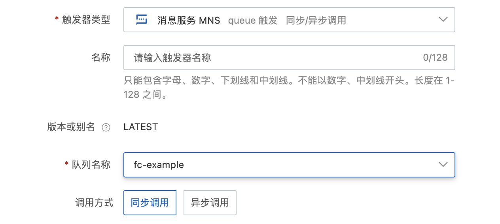
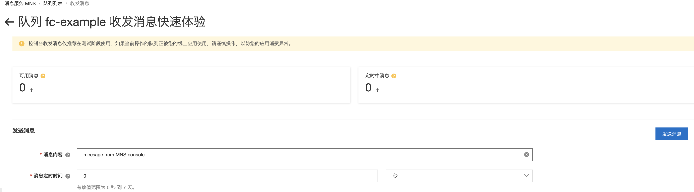

# Golang 消息服务 MNS 队列触发器示例

本示例为您展示了 Golang runtime 的 [消息服务MNS](https://help.aliyun.com/document_detail/27414.html) 队列模型触发器示例。
本示例使用了 MNS 的队列模型作为示例，与示例  golang-mns-queue-producer 一起实现了消息服务的生产者-消费者模型。
MNS的配置在函数的环境变量配置中（参考s.yaml)。

## 准备开始
- 一个可用的mns队列，可参考MNS官方文档[队列模型快速入门-创建队列](https://help.aliyun.com/document_detail/34417.html) 创建。
- [开通事件总线EventBridge并授权](https://help.aliyun.com/document_detail/182246.html)
- 有 MNS 权限的 RAM 用户
  - 也可参考MNS官方文档[开通消息服务MNS并授权](https://help.aliyun.com/document_detail/27423.html)，函数计算需要该RAM密钥访问MNS队列。
- [可选] 安装并配置 Serverless Devs 工具。（https://help.aliyun.com/document_detail/195474.html）

## 快速开始

### 方式一、使用控制台创建

#### 1. 编译打包

```shell
# 编译部署
GOOS=linux GOARCH=amd64 go build main.go
# 打包文件
zip main.zip main
```

> 以上命令只适用于 Linux/Mac 环境，Windows 环境可参考官方文档: [在 Windows 下编译打包](https://help.aliyun.com/document_detail/418490.html#section-qfg-n9c-m9v)


#### 2. 创建函数
选择服务（或创建服务）后，单击创建函数
- 选择 `从零开始创建`
- 填入函数名称
- 选择运行环境 Go 1
- 选择函数触发方式：通过事件请求触发
- 其他设置使用默认

> 详细创建函数流程见文档: [使用控制台创建函数](https://help.aliyun.com/document_detail/51783.html)

#### 3. 使用模拟数据测试
```json
{
  "id":"c2g71017-6f65-fhcf-a814-a396fc8d****",
  "source":"MNS-Function-mnstrigger",
  "specversion":"1.0",
  "type":"mns:Queue:SendMessage",
  "datacontenttype":"application/json; charset=utf-8",
  "subject":"acs:mns:cn-hangzhou:164901546557****:queues/zeus",
  "time":"2021-04-08T06:28:17.093Z",
  "aliyunaccountid":"1649015465xxxxxx",
  "aliyunpublishtime":"2021-10-15T07:06:34.028Z",
  "aliyunoriginalaccountid":"164901546557****",
  "aliyuneventbusname":"MNS-Function-mnstrigger",
  "aliyunregionid":"cn-chengdu",
  "aliyunpublishaddr":"42.120.XX.XX",
  "data":{
      "requestId":"606EA3074344430D4C81****",
      "messageId":"C6DB60D1574661357FA227277445****",
      "messageBody":"TEST"
  }
}
```
测试返回结果如下所示：
```bash
"MessageBody:TEST"
```

返回日志如下所示
```bash
2022/07/28 17:13:50.317865 start
FC Invoke Start RequestId: 295fddae-ec57-43ed-8864-17eed714xxxx
2022-07-29 01:13:50 295fddae-ec57-43ed-8864-17eed714xxxx [INFO] main.go:16: event: {"id":"c2g71017-6f65-fhcf-a814-a396fc8d****","source":"MNS-Function-mnstrigger","specversion":"1.0","type":"mns:Queue:SendMessage","datacontenttype":"application/json; charset=utf-8","subject":"acs:mns:cn-hangzhou:164901546557****:queues/zeus","time":"2021-04-08T06:28:17.093Z","aliyunaccountid":"1649015465xxxxxx","aliyunpublishtime":"2021-10-15T07:06:34.028Z","aliyunoriginalaccountid":"164901546557****","aliyuneventbusname":"MNS-Function-mnstrigger","aliyunregionid":"cn-chengdu","aliyunpublishaddr":"42.120.XX.XX","data":{"requestId":"606EA3074344430D4C81****","messageId":"C6DB60D1574661357FA227277445****","messageBody":"TEST"}}
FC Invoke End RequestId: 295fddae-ec57-43ed-8864-17eed714xxxx
```

#### 4. 配置MNS触发器
选择 queue 模型 MNS 触发器



#### 5. 通过MNS控制台触发测试函数



在函数计算控制台查看请求日志，如下所示：
```bash
2022-07-29 01:15:22FC Invoke Start RequestId: EB0A77CA8076444C35259077119Cxxxx
2022-07-29 01:15:222022-07-29 01:15:22 EB0A77CA8076444C35259077119Cxxxx [INFO] main.go:16: event: {"id":"EB0A77CA8076444C35259077119Cxxxx","source":"MNS-go-mns-queue-trigger-eventbridgeTriggerWithMNSSourcexxxx","specversion":"1.0","type":"mns:Queue:SendMessage","datacontenttype":"application/json;charset=utf-8","subject":"acs:mns:cn-shenzhen:143199xxxxxxxxxx:queues/fc-example","time":"2022-07-28T17:15:22.396Z","aliyunaccountid":"143199xxxxxxxxxx","aliyunpublishtime":"2022-07-28T17:15:22.434Z","aliyunoriginalaccountid":"143199xxxxxxxxxx","aliyuneventbusname":"MNS-go-mns-queue-trigger-eventbridgeTriggerWithMNSSourcexxxx","aliyunregionid":"cn-shenzhen","aliyunpublishaddr":"10.58.xx.xx","data":{"requestId":"62E2C42A463137350358xxxx","messageId":"EB0A77CA8076444C35259077119Cxxxx","messageBody":" message from mns console"}}
2022-07-29 01:15:22FC Invoke End RequestId: EB0A77CA8076444C35259077119Cxxxx
```

### 方式二、使用 Serverless Devs 工具编译部署
该方式使用模拟数据进行调用测试

#### 1. 修改 s.yaml 配置

[Yaml完整配置](https://github.com/devsapp/fc/tree/main/docs/zh/yaml)

- 根据需要修改 access 配置

- 添加 mns 队列触发器配置

  ```yaml
      triggers:  
        - name: eventbridgeTriggerWithMNSSource       
        type: eventbridge        
        config:      
          triggerEnable: true
          asyncInvocationType: false
          eventRuleFilterPattern: '{"source":["MNS-${functionName}-eventbridgeTriggerWithMNSSource"]}'
          eventSourceConfig:
            eventSourceType: MNS
            eventSourceParameters:
              sourceMNSParameters:
                QueueName: fc-example
                IsBase64Decode: true
  ```

#### 2. 安装依赖并部署

编译部署代码包
```shell
s deploy
```
#### 3. 使用模拟数据测试

```shell
s invoke --event-file event.json
```

调用函数时收到的响应如下所示：

```bash
========= FC invoke Logs begin =========
FC Invoke Start RequestId: 179bc6c9-b744-4027-9062-e7e7724axxxx
2022-07-28T17:18:38.175Z 179bc6c9-b744-4027-9062-e7e7724axxxx [INFO] main.go:16: event: {"id":"c2g71017-6f65-fhcf-a814-a396fc8d****","source":"MNS-Function-mnstrigger","specversion":"1.0","type":"mns:Queue:SendMessage","datacontenttype":"application/json; charset=utf-8","subject":"acs:mns:cn-hangzhou:164901546557****:queues/zeus","time":"2021-04-08T06:28:17.093Z","aliyunaccountid":"1649015465574023","aliyunpublishtime":"2021-10-15T07:06:34.028Z","aliyunoriginalaccountid":"164901546557****","aliyuneventbusname":"MNS-Function-mnstrigger","aliyunregionid":"cn-chengdu","aliyunpublishaddr":"42.120.XX.XX","data":{"requestId":"606EA3074344430D4C81****","messageId":"C6DB60D1574661357FA227277445****","messageBody":"TEST"}}
FC Invoke End RequestId: 179bc6c9-b744-4027-9062-e7e7724axxxx

Duration: 1.27 ms, Billed Duration: 2 ms, Memory Size: 128 MB, Max Memory Used: 10.01 MB
========= FC invoke Logs end =========
FC Invoke instanceId: c-62e2c3ce-a6b37a996f624ee7xxxx

FC Invoke Result:
"MessageBody:TEST"

End of method: invoke
```

## 注意事项
1. MNS消息服务和函数计算建议部署在同一个地域