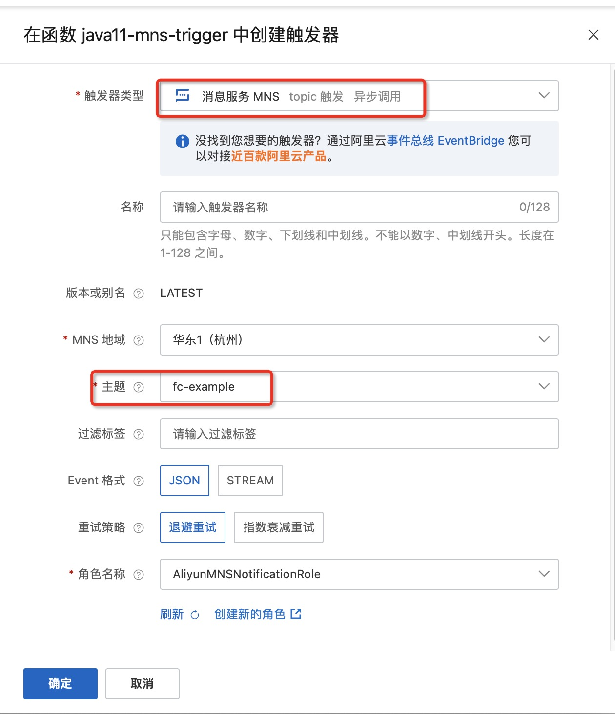
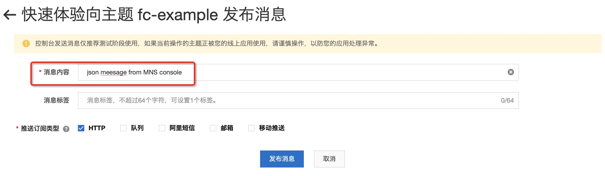

# Golang 消息服务 MNS 触发器示例

本示例为您展示了 golang runtime 的 [消息服务MNS](https://help.aliyun.com/document_detail/27414.html) 主题模型触发器示例。
本示例使用了 MNS 的主题模型作为示例，与示例  golang-mns-topic-producer 一起实现了消息服务的生产者-消费者模型。
MNS的配置在函数的环境变量配置中（参考s.yaml)。

## 准备开始
- 一个可用的mns主题，可参考MNS官方文档[主题模型快速入门-创建主题](https://help.aliyun.com/document_detail/34424.html) 创建。
- 有 MNS 权限的 RAM 用户
  - 也可参考MNS官方文档[开通消息服务MNS并授权](https://help.aliyun.com/document_detail/27423.html)，函数计算需要该RAM密钥访问MNS主题。
- [可选] 安装并配置 Serverless Devs 工具。（https://help.aliyun.com/document_detail/195474.html）

## 快速开始

### 方式一、使用控制台创建

#### 1. 编译打包

```shell
# 编译部署
GOOS=linux GOARCH=amd64 go build main.go
# 打包文件
zip main.zip main
```

> 以上命令只适用于 Linux/Mac 环境，Windows 环境可参考官方文档: [在 Windows 下编译打包](https://help.aliyun.com/document_detail/418490.html#section-qfg-n9c-m9v)


#### 2. 创建函数
选择服务（或创建服务）后，单击创建函数
- 选择 `从零开始创建`
- 填入函数名称
- 选择运行环境 Go 1
- 选择函数触发方式：通过事件请求触发
- 其他设置使用默认

> 详细创建函数流程见文档: [使用控制台创建函数](https://help.aliyun.com/document_detail/51783.html)

#### 3. 使用模拟数据测试
- 3.1 Json类型的测试事件
```json
{
  "TopicOwner":"topic account id",
  "Message":"mock mns message",
  "Subscriber":"subscriber account id",
  "PublishTime":1658235558094,
  "SubscriptionName":"test-5bf13c7e",
  "MessageMD5":"652BF0E6297840015247C3xxxxxxx",
  "TopicName":"fc-example",
  "MessageId":"3405CA51807661353B3xxxxxxxx"
}
```
测试返回结果如下所示：
```bash
"MessageBody:mock mns message"
```

返回日志如下所示
```bash
2022-07-29 02:47:30FC Invoke Start RequestId: e636971c-0f3d-4b0e-a289-d45a34d7xxxx
2022-07-29 02:47:302022-07-29 02:47:30 e636971c-0f3d-4b0e-a289-d45a34d7xxxx [INFO] main.go:25: event: map[Message:mock mns message MessageId:3405CA51807661353B3xxxxxxxx MessageMD5:652BF0E6297840015247C3xxxxxxx PublishTime:1.658235558094e+12 Subscriber:subscriber account id SubscriptionName:test-5bf13c7e TopicName:fc-example TopicOwner:topic account id]
2022-07-29 02:47:30FC Invoke End RequestId: e636971c-0f3d-4b0e-a289-d45a34d7xxxx
```

- 3.2 Stream类型的测试事件
```bash
"mock mns stream message"
```

测试返回结果如下所示：
```bash
"MessageBody:mock mns stream message"
```

返回日志如下所示
```bash
2022-07-29 02:49:33FC Invoke Start RequestId: f337bbe8-a5f8-4b06-8357-e8c4b6f8xxxx
2022-07-29 02:49:332022-07-29 02:49:33 f337bbe8-a5f8-4b06-8357-e8c4b6f8xxxx [INFO] main.go:19: event: mock mns stream message
2022-07-29 02:49:33FC Invoke End RequestId: f337bbe8-a5f8-4b06-8357-e8c4b6f8xxxx
```

#### 4. 配置MNS触发器
- 选择 topic 模型 MNS 触发器
- 选择 JSON 的 Event 格式



#### 5. 通过MNS控制台触发测试函数



在函数计算控制台查看请求日志，如下所示：
```bash
2022-07-29 02:51:39FC Invoke Start RequestId: CEBD8A24-8980-594C-87A6-5E5882CBxxxx
2022-07-29 02:51:392022-07-29 02:51:39 CEBD8A24-8980-594C-87A6-5E5882CBxxxx [INFO] main.go:25: event: map[Message:json meesage from MNS console MessageId:CC9C55A98076444C2B3790CF37CBxxxx MessageMD5:D2DE9F47F7987095172CF5956D85xxxx PublishTime:1.65903429934e+12 Subscriber:143199xxxxxxxxxx SubscriptionName:mns-af29c6cf TopicName:fc-example TopicOwner:143199xxxxxxxxxx]
2022-07-29 02:51:39FC Invoke End RequestId: CEBD8A24-8980-594C-87A6-5E5882CBxxxx
```

### 方式二、使用 Serverless Devs 工具编译部署
该方式使用模拟数据进行调用测试

#### 1. 修改 s.yaml 配置

[Yaml完整配置](https://gitee.com/devsapp/fc/blob/main/docs/zh/yaml/readme.md#yaml%E5%AE%8C%E6%95%B4%E9%85%8D%E7%BD%AE)

- 根据需要修改 access 配置

- 添加 [mns 触发器](https://gitee.com/devsapp/fc/blob/main/docs/zh/yaml/triggers.md#mns%E8%A7%A6%E5%8F%91%E5%99%A8) 配置

  ```yaml
        triggers:
          - name: {TriggerName}
            description: ''
            sourceArn: acs:mns:{Region}:{AccountID}:/topics/{TopicName}
            type: mns_topic
            role: acs:ram::{AccountID}:role/aliyunmnsnotificationrole
            qualifier: LATEST
            config:
              filterTag: ''
              notifyContentFormat: JSON
              notifyStrategy: BACKOFF_RETRY
  ```

#### 2. 安装依赖并部署

编译部署代码包
```shell
s deploy
```
#### 3. 使用模拟数据测试

```shell
s invoke --event-file event.json
```

调用函数时收到的响应如下所示：

```bash
========= FC invoke Logs begin =========
FC Invoke Start RequestId: 250efb53-48ac-4e76-a6b2-dabde6a0xxxx
2022-07-28T18:43:50.784Z 250efb53-48ac-4e76-a6b2-dabde6a0xxxx [INFO] main.go:25: event: map[Message:mock mns message MessageId:3405CA51807661353B3xxxxxxxx MessageMD5:652BF0E6297840015247C3xxxxxxx PublishTime:1.658235558094e+12 Subscriber:subscriber account id SubscriptionName:test-5bf13c7e TopicName:fc-example TopicOwner:topic account id]
FC Invoke End RequestId: 250efb53-48ac-4e76-a6b2-dabde6a0xxxx

Duration: 0.87 ms, Billed Duration: 1 ms, Memory Size: 128 MB, Max Memory Used: 9.82 MB
========= FC invoke Logs end =========

FC Invoke instanceId: c-62e2d846-995c5020672547c6xxxx

FC Invoke Result:
"MessageBody:mock mns message"

End of method: invoke
```

## 注意事项
1. MNS消息服务和函数计算建议部署在同一个地域