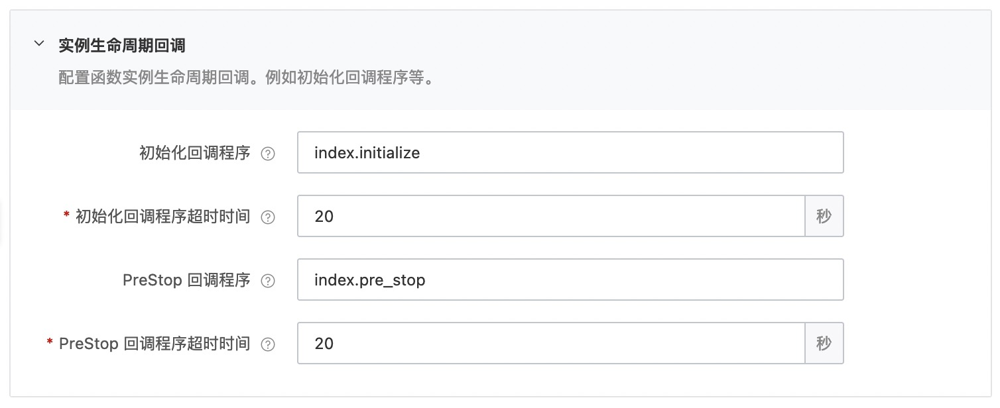

# 使用 initializer 和 preStop 回调函数的 mysql 示例
本示例为您展示了 Golang runtime的mysql使用示例。
在本示例中，mysql数据库配置在函数的环境变量配置中（参考s.yaml)，initializer 回调函数从环境变量中获取数据库配置，创建mysql连接并测试连通性，preStop 回调函数负责关闭mysql连接。


## 准备开始
- 一个可用的mysql数据库，可以参考以下sql创建表并插入测试数据

```sql
CREATE TABLE `users` (
  `id` bigint(20) unsigned NOT NULL AUTO_INCREMENT,
  `name` varchar(20) NOT NULL,
  `age` tinyint(11) NOT NULL DEFAULT '0',
  PRIMARY KEY (`id`)
) ENGINE=InnoDB DEFAULT CHARSET=utf8;

INSERT INTO `users` (`id`, `name`, `age`) VALUES
(1, '张三', 18),
(2, '李四', 28);
```

- [可选] 安装并配置 Serverless Devs 工具，以及 docker daemon。（https://help.aliyun.com/document_detail/195474.html）

## 快速开始

### 方式一、使用控制台创建

#### 1. 编译打包

```shell
# 编译部署
GOOS=linux GOARCH=amd64 go build main.go
# 打包文件
zip main.zip main
```

> 以上命令只适用于 Linux/Mac 环境，Windows 环境可参考官方文档: [在 Windows 下编译打包](https://help.aliyun.com/document_detail/418490.html#section-qfg-n9c-m9v)

创建函数并上传代码包

#### 2. 设置initializer/preStop回调函数配置和环境变量配置

回调函数配置


环境变量配置


#### 3. 调用测试

返回结果如下所示:

```bash
succ
```

日志内容如下:

```bash
2022-07-28 01:18:352022/07/27 17:18:35.532031 start
2022-07-28 01:18:35FC Initialize Start RequestId: 90e4e980-0772-4682-9b14-51319a20xxxx
2022-07-28 01:18:35FC Initialize End RequestId: 90e4e980-0772-4682-9b14-51319a20xxxx
2022-07-28 01:18:35FC Invoke Start RequestId: 90e4e980-0772-4682-9b14-51319a20xxxx
2022-07-28 01:18:352022/07/27 17:18:35.735864 New data ID added to the database is：3
2022-07-28 01:18:352022/07/27 17:18:35.770229 user: {3 王二 38}
2022-07-28 01:18:35FC Invoke End RequestId: 90e4e980-0772-4682-9b14-51319a20xxxx
2022-07-28 01:18:35FC PreStop Start RequestId: 9b813de1-e3db-4be3-95c7-71b90d70xxxx
2022-07-28 01:18:35FC PreStop End RequestId: 9b813de1-e3db-4be3-95c7-71b90d70xxxx
```

### 方式二、使用 Serverless Devs 工具编译部署

#### 1. 修改 s.yaml 配置
- 根据需要修改 access 配置
- 修改 environmentVariables 配置，填入 MYSQL_USER, MYSQL_PASSWORD, MYSQL_ENDPOING, MYSQL_PORT 和 MYSQL_DBNAME
- 使用 initialize 和 prestop 回调，需要在 s.yaml 中配置

```yaml
        initializationTimeout: 20
        initializer: index.initialize
        instanceLifecycleConfig:
          preStop:
            handler: index.pre_stop
            timeout: 20
```

#### 2. 安装依赖并部署

编译部署代码包
```shell
s deploy
```

#### 3. 调用测试

```shell
s invoke
```

调用函数时收到的响应如下所示：

```bash
========= FC invoke Logs begin =========
2022/07/27 17:03:53.658138 start
FC Initialize Start RequestId: f4a2f08e-d412-413b-a681-13908d6fxxxx
FC Initialize End RequestId: f4a2f08e-d412-413b-a681-13908d6fxxxx
FC Invoke Start RequestId: 81f1b61a-a34c-4154-b263-6a19f97cxxxx
2022/07/27 17:03:57.722069 New data ID added to the database is：3
2022/07/27 17:03:57.756517 user: {3 王二 38}
FC Invoke End RequestId: 81f1b61a-a34c-4154-b263-6a19f97cxxxx

Duration: 210.07 ms, Billed Duration: 211 ms, Memory Size: 128 MB, Max Memory Used: 9.93 MB
========= FC invoke Logs end =========

FC Invoke instanceId: c-62e16ff9-c72ead5ed6814729xxxx

FC Invoke Result:
"suc"

End of method: invoke
```

## 数据库访问限制
当使用云数据库时，一般都会有访问控制，比如阿里云数据库RDS中的白名单设置（ [RDS白名单设置说明](https://help.aliyun.com/document_detail/43185.html?spm=5176.19908528.help.dexternal.6c721450iLu0jH) )。

如果仅仅作为测试，可以将白名单配置成 `0.0.0.0/0`。（不要在生产环境使用!)

在生产环境，可以使用以下两种方式访问：

1. VPC方式（**推荐**） <br>
参考文档：https://help.aliyun.com/document_detail/84514.html
2. 代理方式<br>
参考文档：https://help.aliyun.com/document_detail/91243.html

## 备注
1. 本示例不是连接池方式，因python不支持单实例多并发，可以不使用连接池，若要使用连接池，可以参考文档 [DBUtils User's Guide](https://webwareforpython.github.io/DBUtils/main.html)
