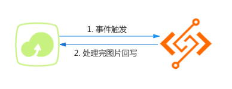
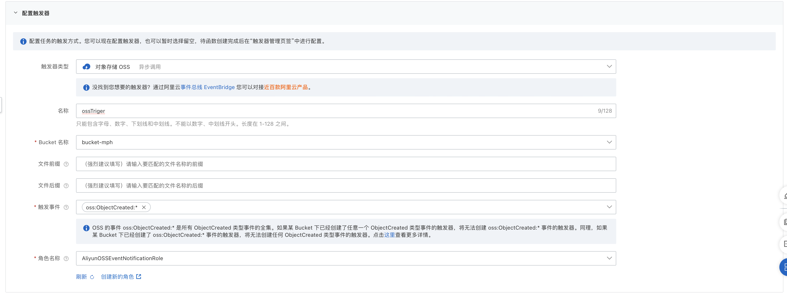
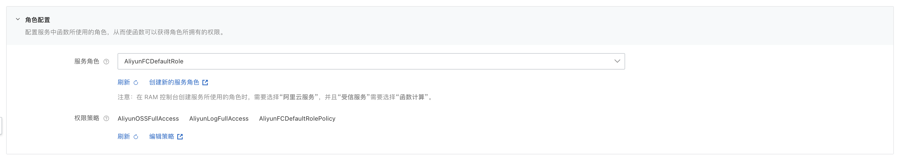
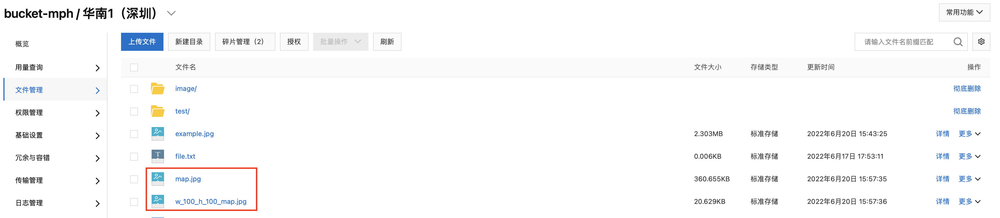

# golang oss 示例程序
本示例演示了当你在 oss 对象存储上传任意一张照片时，会触发 FC 函数，将上传的图片缩放为固定宽高100 px 后保存至 oss 中，并在图片名称添加前缀 “w_100_h_100_” 来区别原图。

示例原理如下图所示：




## 准备开始
- 开通 oss 服务并创建 bucket。
- [可选] 安装并配置 Serverless Devs 工具。（https://help.aliyun.com/document_detail/195474.html）

## 快速开始
### 方式一、使用 Serverless Devs 工具编译部署

#### 1. 修改 s.yaml 配置
- 根据需要修改 access 配置
- 根据需要修改 triggers 配置，详见官方文档 [triggers 字段](https://docs.serverless-devs.com/fc/yaml/triggers)
  - 其中 triggers 字段中的 role 参数指一个 RAM 角色的 ARN，是函数指定执行角色，事件源会使用该角色触发函数执行，请确保该角色有调用函数的权限。


#### 2. 安装依赖并部署

编译部署代码包
```shell
s deploy
```
部署成功

```shell
✔ Checking Service Learning-6-6 exists
✔ Checking Service, Function, Triggers (7.3s)
✔ Creating Function (4.09s)
✔ Creating Triggers (0.14s)
...
helloworld: 
  region:   cn-shenzhen
  function: 
    name:       fc-golang-oss-devs
    runtime:    go1
    handler:    main
    memorySize: 512
    timeout:    30
  triggers: 
    - 
      type: oss
      name: oss
```

#### 3. 调用测试

```shell
s invoke --event-file event-template/oss-event.json
```

调用函数时收到的响应如下所示：

```bash
========= FC invoke Logs begin =========
FC Invoke Start RequestId: cb608483-8663-4393-bcb5-2eeecaeb24b4
FC Invoke End RequestId: cb608483-8663-4393-bcb5-2eeecaeb24b4

Duration: 121.83 ms, Billed Duration: 122 ms, Memory Size: 512 MB, Max Memory Used: 20.25 MB
========= FC invoke Logs end =========

FC Invoke instanceId: c-62b0401f-9a54b51dc0c94a029bf4

FC Invoke Result:
done

End of method: invoke
```

> 调用测试前需要先创建 event-template/oss-event.json 文件，文件内容如下，根据需要修改相关字段内容。

```json
{
    "events": [
        {
            "eventName": "ObjectCreated:PutObject",
            "eventSource": "acs:oss",
            "eventTime": "2017-04-21T12:46:37.000Z",
            "eventVersion": "1.0",
            "oss": {
                "bucket": {
                    "arn": "acs:oss:<region>:<account-id>:<buckctName>",
                    "name": "<buckctName>",
                    "ownerIdentity": "1237050315******",
                    "virtualBucket": ""
                },
                "object": {
                    "deltaSize": 122539,
                    "eTag": "688A7BF4F233DC9C88A80BF985AB7329",
                    "key": "<imageName>",
                    "size": 122539
                },
                "ossSchemaVersion": "1.0",
                "ruleId": "9adac8e253828f4f7c0466d941fa3db81161e853"
            },
            "region": "cn-shanghai",
            "requestParameters": {
                "sourceIPAddress": "140.**.**.**"
            },
            "responseElements": {
                "requestId": "58F9FF2D3DF792092E12044C"
            },
            "userIdentity": {
                "principalId": "262561392693******"
            }
        }
    ]
}
```

### 方式二、使用控制台创建

#### 1. 编译打包

```shell
# 编译部署
GOOS=linux GOARCH=amd64 go build main.go
# 打包文件
zip main.zip main
```

> 以上命令只适用于 Linux/Mac 环境，Windows 环境可参考官方文档: [在 Windows 下编译打包](https://help.aliyun.com/document_detail/418490.html#section-qfg-n9c-m9v)
>

#### 2. 创建函数
选择服务（或创建服务）后，单击创建函数，如图所示
- 选择 `从零开始创建`
- 填入函数名称
- 选择运行环境 Go1
- 选择函数触发方式：通过事件请求触发
- [请求处理程序](https://help.aliyun.com/document_detail/323526.html)（函数入口）设为：main
- 其他设置使用默认


> 详细创建函数流程见文档: [使用控制台创建函数](https://help.aliyun.com/document_detail/51783.html)

#### 3.创建触发器

为该函数创建 oss 触发器



> 详细创建函数触发器流程见文档：[配置OSS触发器](https://help.aliyun.com/document_detail/74765.html)

#### 4. 设置服务的角色配置
在控制台编辑服务的配置，将角色设置为AliyunOSSFullAccess，或者创建新的服务角色，但要保证角色中有 AliyunOSSFullAccess 权限策略。



> 服务配置官网详细文档：[管理服务](https://help.aliyun.com/document_detail/73337.html)

#### 5. 测试函数

oss 对象存储中会有原图片和缩放后的图片。

