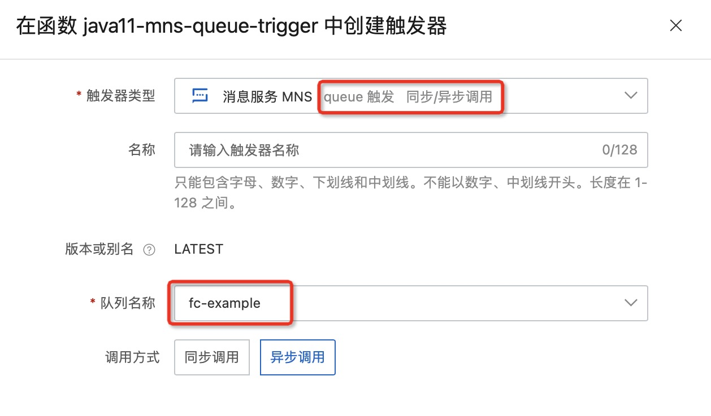
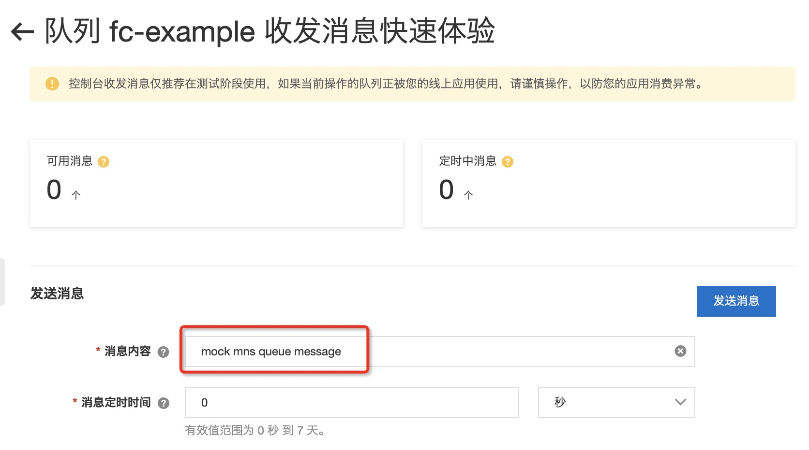

# java11 消息服务 MNS 队列触发器示例

本示例为您展示了Java runtime的 [消息服务MNS](https://help.aliyun.com/document_detail/27414.html) 队列模型触发器示例。
本示例使用了MNS的队列模型作为示例，与示例 java11-mns-queue-producer 一起实现了消息服务的生产者-消费者模型。
MNS的配置在函数的环境变量配置中（参考s.yaml)。

## 准备开始
- 一个可用的mns队列，可参考MNS官方文档[队列模型快速入门-创建队列](https://help.aliyun.com/document_detail/34417.html) 创建。
- [可选] 安装并配置 Serverless Devs 工具。（https://help.aliyun.com/document_detail/195474.html）

## 快速开始

### 方式一、使用控制台创建

#### 1. 编译打包

```shell
# 编译部署
mvn package
# 打包文件
cd target && zip -r java11-mns-queue-trigger.zip *
```

#### 2. 创建函数
选择服务（或创建服务）后，单击创建函数
- 选择 `从零开始创建`
- 填入函数名称
- 选择运行环境 java11/java8
- 选择函数触发方式：通过事件请求触发
- 其他设置使用默认

> 详细创建函数流程见文档: [使用控制台创建函数](https://help.aliyun.com/document_detail/51783.html)

#### 3. 使用模拟数据测试
```json
{
  "id": "2C5424F2807661357FC66F46XXXXX",
  "source": "MNS-java11-mns-queue-trigger-mns-queue-trigger-1",
  "specversion": "1.0",
  "type": "mns:Queue:SendMessage",
  "datacontenttype": "application/json;charset=utf-8",
  "subject": "acs:mns:cn-hangzhou:${AccountID}:queues/fc-example",
  "time": "2022-07-22T06:34:27.9Z",
  "aliyunaccountid": "${AccountID}",
  "aliyunpublishtime": "2022-07-22T06:34:27.943Z",
  "aliyunoriginalaccountid": "${AccountID}",
  "aliyuneventbusname": "MNS-java11-mns-queue-trigger-mns-queue-trigger-1",
  "aliyunregionid": "cn-hangzhou",
  "aliyunpublishaddr": "172.20.xx.xx",
  "data": {
    "requestId": "62DA44F3373832393xxxxxx",
    "messageId": "2C5424F2807661357FC66xxxxxx",
    "messageBody": "bW9jayBtbnMgcXVldWUgbWVzc2FnZQ=="
  }
}
```
测试返回结果如下所示：
```bash
mock mns queue message
```

返回日志如下所示
```bash
FC Invoke Start RequestId: 4153907b-6f42-4241-ae93-xxxxxxx
2022-07-25 11:44:12.775 [INFO] [4153907b-6f42-4241-ae93-f4f19db239b6] Input data: {
  "id": "2C5424F2807661357FC66F46XXXXX",
  "source": "MNS-java11-mns-queue-trigger-mns-queue-trigger-1",
  "specversion": "1.0",
  "type": "mns:Queue:SendMessage",
  "datacontenttype": "application/json;charset=utf-8",
  "subject": "acs:mns:cn-hangzhou:${AccountID}:queues/fc-example",
  "time": "2022-07-22T06:34:27.9Z",
  "aliyunaccountid": "${AccountID}",
  "aliyunpublishtime": "2022-07-22T06:34:27.943Z",
  "aliyunoriginalaccountid": "${AccountID}",
  "aliyuneventbusname": "MNS-java11-mns-queue-trigger-mns-queue-trigger-1",
  "aliyunregionid": "cn-hangzhou",
  "aliyunpublishaddr": "172.20.xx.xx",
  "data": {
    "requestId": "62DA44F3373832393xxxxxx",
    "messageId": "2C5424F2807661357FC66xxxxxx",
    "messageBody": "bW9jayBtbnMgcXVldWUgbWVzc2FnZQ=="
  }
}
2022-07-25 11:44:13.273 [INFO] [4153907b-6f42-4241-ae93-xxxxxxx] mns message: MnsQueueMessageFromEB{id='2C5424F2807661357FC66F46XXXXX', source='MNS-java11-mns-queue-trigger-mns-queue-trigger-1', specversion='1.0', type='mns:Queue:SendMessage', datacontenttype='application/json;charset=utf-8', subject='acs:mns:cn-hangzhou:${AccountID}:queues/fc-example', time='2022-07-22T06:34:27.9Z', aliyunaccountid='${AccountID}', aliyunpublishtime='2022-07-22T06:34:27.943Z', aliyunoriginalaccountid='${AccountID}', aliyuneventbusname='MNS-java11-mns-queue-trigger-mns-queue-trigger-1', aliyunregionid='cn-hangzhou', aliyunpublishaddr='172.20.xx.xx', data={requestId='62DA44F3373832393xxxxxx', messageId='2C5424F2807661357FC66xxxxxx', messageBody='bW9jayBtbnMgcXVldWUgbWVzc2FnZQ=='}}
2022-07-25 11:44:13.277 [INFO] [4153907b-6f42-4241-ae93-xxxxxxx] publish time:2022-07-22T06:34:27.943
2022-07-25 11:44:13.278 [INFO] [4153907b-6f42-4241-ae93-xxxxxxx] message trigger time cost:PT77H9M45.33429S
FC Invoke End RequestId: 4153907b-6f42-4241-ae93-xxxxxxx
```

#### 4. 配置MNS触发器
- 选择 queue 模型 MNS 触发器
- 选择调用方式 异步/同步
> 注意：若选择 STREAM 的 Event 格式，在代码中则不需要将 Event 解析成json。


#### 5. 通过MNS控制台触发测试函数



在函数计算控制台查看请求日志，如下所示：
```bash
FC Invoke Start RequestId: 2C5424F280767FBA7FFB7FEXXXXXX
2022-07-25 12:01:08.459 [INFO] [2C5424F280767FBA7FFB7FEXXXXXX] Input data: {"id":"2C5424F280767FBA7FFB7FEXXXXXX","source":"MNS-java11-mns-queue-trigger-mns-queue-trigger-1","specversion":"1.0","type":"mns:Queue:SendMessage","datacontenttype":"application/json;charset=utf-8","subject":"acs:mns:cn-hangzhou:${accountID}:queues/fc-example","time":"2022-07-25T12:01:07.673Z","aliyunaccountid":"${accountID}","aliyunpublishtime":"2022-07-25T12:01:07.788Z","aliyunoriginalaccountid":"${accountID}","aliyuneventbusname":"MNS-java11-mns-queue-trigger-mns-queue-trigger-1","aliyunregionid":"cn-hangzhou","aliyunpublishaddr":"172.20.xxx.xx","data":{"requestId":"62DE86034545391xxxxxxxx","messageId":"2C5424F280767FBA7FFB7FE44Axxxxxx","messageBody":"bW9jayBtbnMgcXVldWUgbWVzc2FnZQ=="}}
2022-07-25 12:01:08.986 [INFO] [2C5424F280767FBA7FFB7FEXXXXXX] mns message: MnsQueueMessageFromEB{id='2C5424F280767FBA7FFB7FEXXXXXX', source='MNS-java11-mns-queue-trigger-mns-queue-trigger-1', specversion='1.0', type='mns:Queue:SendMessage', datacontenttype='application/json;charset=utf-8', subject='acs:mns:cn-hangzhou:${accountID}:queues/fc-example', time='2022-07-25T12:01:07.673Z', aliyunaccountid='${accountID}', aliyunpublishtime='2022-07-25T12:01:07.788Z', aliyunoriginalaccountid='${accountID}', aliyuneventbusname='MNS-java11-mns-queue-trigger-mns-queue-trigger-1', aliyunregionid='cn-hangzhou', aliyunpublishaddr='172.20.xxx.xx', data={requestId='62DE86034545391xxxxxxxx', messageId='2C5424F280767FBA7FFB7FE44Axxxxxx', messageBody='bW9jayBtbnMgcXVldWUgbWVzc2FnZQ=='}}
2022-07-25 12:01:08.991 [INFO] [2C5424F280767FBA7FFB7FEXXXXXX] publish time:2022-07-25T12:01:07.788
2022-07-25 12:01:08.992 [INFO] [2C5424F280767FBA7FFB7FEXXXXXX] message trigger time cost:PT1.203067S
FC Invoke End RequestId: 2C5424F280767FBA7FFB7FEXXXXXX
```

### 方式二、使用 Serverless Devs 工具编译部署
该方式使用模拟数据进行调用测试

#### 1. 修改 s.yaml 配置
- 根据需要修改 access 配置
- 添加 [mns 触发器配置](https://github.com/devsapp/fc/blob/main/docs/zh/yaml/triggers.md#eventbridge%E8%A7%A6%E5%8F%91%E5%99%A8)
```yaml
        triggers:
          - name: eventbridgeTriggerWithMNSSource
            # sourceArn: acs:eventbridge:<region>:<accountID>:eventbus/<eventBusName>/rule/<eventRuleName>
            type: eventbridge
            # qualifier: LATEST
            config:
              triggerEnable: true
              asyncInvocationType: false
              # eventRuleFilterPattern: '{"source":["MNS-fc-example-eventbridgeTriggerWithMNSSource"]}'
              eventSourceConfig:
                eventSourceType: MNS
                eventSourceParameters:
                  sourceMNSParameters:
                    QueueName: fc-example
                    IsBase64Decode: false
```
- 确保Serverless Devs工具配置的access拥有AliyunEventBridgeFullAccess权限

#### 2. 安装依赖并部署

编译部署代码包
```shell
s deploy
```

> 注意: `pom.xml` 中有配置 `pre-deploy` 脚本 `mvn package`, 在部署前会调用 `mvn package` 编译打包。

#### 3. 使用模拟数据测试

```shell
s invoke --event-file event.json
```

调用函数时收到的响应如下所示：

```bash
========= FC invoke Logs begin =========
FC Invoke Start RequestId: de6a8ccd-488c-4dac-a129-xxxxxxxx
2022-07-25 12:31:07.234 [INFO] [de6a8ccd-488c-4dac-a129-xxxxxxxx] Input data: {  "id": "2C5424F2807661357FC66F46XXXXX",  "source": "MNS-java11-mns-queue-trigger-mns-queue-trigger-1",  "specversion": "1.0",  "type": "mns:Queue:SendMessage",  "datacontenttype": "application/json;charset=utf-8",  "subject": "acs:mns:cn-hangzhou:${AccountID}:queues/fc-example",  "time": "2022-07-22T06:34:27.9Z",  "aliyunaccountid": "${AccountID}",  "aliyunpublishtime": "2022-07-22T06:34:27.943Z",  "aliyunoriginalaccountid": "${AccountID}",  "aliyuneventbusname": "MNS-java11-mns-queue-trigger-mns-queue-trigger-1",  "aliyunregionid": "cn-hangzhou",  "aliyunpublishaddr": "172.20.xx.xx",  "data": {    "requestId": "62DA44F3373832393xxxxxx",    "messageId": "2C5424F2807661357FC66xxxxxx",    "messageBody": "bW9jayBtbnMgcXVldWUgbWVzc2FnZQ=="  }}
2022-07-25 12:31:07.237 [INFO] [de6a8ccd-488c-4dac-a129-xxxxxxxx] mns message: MnsQueueMessageFromEB{id='2C5424F2807661357FC66F46XXXXX', source='MNS-java11-mns-queue-trigger-mns-queue-trigger-1', specversion='1.0', type='mns:Queue:SendMessage', datacontenttype='application/json;charset=utf-8', subject='acs:mns:cn-hangzhou:${AccountID}:queues/fc-example', time='2022-07-22T06:34:27.9Z', aliyunaccountid='${AccountID}', aliyunpublishtime='2022-07-22T06:34:27.943Z', aliyunoriginalaccountid='${AccountID}', aliyuneventbusname='MNS-java11-mns-queue-trigger-mns-queue-trigger-1', aliyunregionid='cn-hangzhou', aliyunpublishaddr='172.20.xx.xx', data={requestId='62DA44F3373832393xxxxxx', messageId='2C5424F2807661357FC66xxxxxx', messageBody='bW9jayBtbnMgcXVldWUgbWVzc2FnZQ=='}}
2022-07-25 12:31:07.238 [INFO] [de6a8ccd-488c-4dac-a129-xxxxxxxx] publish time:2022-07-22T06:34:27.943
2022-07-25 12:31:07.238 [INFO] [de6a8ccd-488c-4dac-a129-xxxxxxxx] message trigger time cost:PT77H56M39.29524S
FC Invoke End RequestId: de6a8ccd-488c-4dac-a129-xxxxxxxx

Duration: 5.87 ms, Billed Duration: 6 ms, Memory Size: 256 MB, Max Memory Used: 105.04 MB
========= FC invoke Logs end =========

FC Invoke instanceId: c-62de8bc3-a6ffb00d74e4xxxxxxxx

FC Invoke Result:
mock mns queue message


End of method: invoke
```

## 注意事项
1. MNS消息服务和函数计算建议部署在同一个地域
2. 消息触发后，不需要主动删除消息，该消息会在投递成功后自动删除