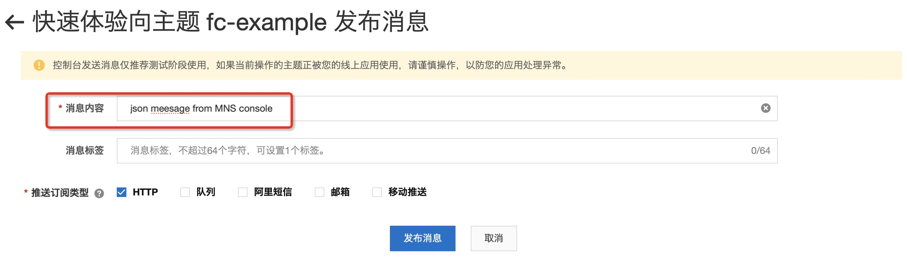

# java11 消息服务 MNS 触发器示例

本示例为您展示了Java runtime的 [消息服务MNS](https://help.aliyun.com/document_detail/27414.html) 主题模型触发器示例。
本示例使用了MNS的主题模型作为示例，与示例 java11-mns-topic-producer 一起实现了消息服务的生产者-消费者模型。
MNS的配置在函数的环境变量配置中（参考s.yaml)。

## 准备开始
- 一个可用的mns主题，可参考MNS官方文档[主题模型快速入门-创建主题](https://help.aliyun.com/document_detail/34424.html) 创建。
- [可选] 安装并配置 Serverless Devs 工具。（https://help.aliyun.com/document_detail/195474.html）

## 快速开始

### 方式一、使用控制台创建

#### 1. 编译打包

```shell
# 编译部署
mvn package
# 打包文件
cd target && zip -r java11-mns-topic-trigger.zip *
```

#### 2. 创建函数
选择服务（或创建服务）后，单击创建函数
- 选择 `从零开始创建`
- 填入函数名称
- 选择运行环境 java11/java8
- 选择函数触发方式：通过事件请求触发
- 其他设置使用默认

> 详细创建函数流程见文档: [使用控制台创建函数](https://help.aliyun.com/document_detail/51783.html)

#### 3. 使用模拟数据测试
- 3.1 Json类型的测试事件
```json
{
  "TopicOwner":"topic account id",
  "Message":"mock mns message",
  "Subscriber":"subscriber account id",
  "PublishTime":1658235558094,
  "SubscriptionName":"test-5bf13c7e",
  "MessageMD5":"652BF0E6297840015247C3xxxxxxx",
  "TopicName":"fc-example",
  "MessageId":"3405CA51807661353B3xxxxxxxx"
}
```
测试返回结果如下所示：
```bash
json mock mns message
```

返回日志如下所示
```bash
FC Invoke Start RequestId: a78bb35f-77e0-49e8-bb64-332e68588429
2022-07-20 02:32:32.810 [INFO] [a78bb35f-77e0-49e8-bb64-332e68588429] Input data: {
  "TopicOwner":"topic account id",
  "Message":"json mock mns message",
  "Subscriber":"subscriber account id",
  "PublishTime":1658235558094,
  "SubscriptionName":"test-5bf13c7e",
  "MessageMD5":"652BF0E6297840015247C3xxxxxxx",
  "TopicName":"fc-example",
  "MessageId":"3405CA51807661353B3xxxxxxxx"
}
2022-07-20 02:32:33.228 [INFO] [a78bb35f-77e0-49e8-bb64-332e68588429] mns message: MnsMessage{topicName='fc-example', topicOwner='topic account id', message='mock mns message', messageId='3405CA51807661353B3xxxxxxxx', messageMD5='652BF0E6297840015247C3xxxxxxx', subscriber='subscriber account id', subscriptionName='test-5bf13c7e', publishTime=1658235558094}
FC Invoke End RequestId: a78bb35f-77e0-49e8-bb64-332e68588429
```

- 3.2 Stream类型的测试事件
```bash
stream mock mns message
```

测试返回结果如下所示：
```bash
stream mock mns message
```

返回日志如下所示
```bash
FC Invoke Start RequestId: BC0AC6E7-229E-572B-9244-xxxxxxxxx
2022-07-20 02:44:48.324 [INFO] [BC0AC6E7-229E-572B-9244-xxxxxxxxx] Input data: {"TopicOwner":"xxxxxxxxx","Message":"json meesage from MNS console","Subscriber":"xxxxxxxxx","PublishTime":1658285087205,"SubscriptionName":"test-5bf13c7e","MessageMD5":"D2DE9F47F7987095172CF5956D856DEA","TopicName":"fc-example","MessageId":"3405CA518076630D4B1D642725E44945"}
2022-07-20 02:44:48.746 [INFO] [BC0AC6E7-229E-572B-9244-54926DCAD390] mns message: MnsMessage{topicName='fc-example', topicOwner='xxxxxxxxx', message='json meesage from MNS console', messageId='3405CA518076630D4B1D642725E44945', messageMD5='D2DE9F47F7987095172CF5956D856DEA', subscriber='xxxxxxxxx', subscriptionName='test-5bf13c7e', publishTime=1658285087205}
FC Invoke End RequestId: BC0AC6E7-229E-572B-9244-xxxxxxxxx
```

#### 4. 配置MNS触发器
- 选择 topic 模型 MNS 触发器
- 选择 JSON 的 Event 格式

> 注意：若选择 STREAM 的 Event 格式，在代码中则不需要将 Event 解析成json。


#### 5. 通过MNS控制台触发测试函数



在函数计算控制台查看请求日志，如下所示：
```bash
FC Invoke Start RequestId: fdc71aaf-7382-4479-9ace-36fc6ca96409
2022-07-20 02:41:07.989 [INFO] [fdc71aaf-7382-4479-9ace-36fc6ca96409] Input data: stream mock mns message
2022-07-20 02:41:08.354 [INFO] [fdc71aaf-7382-4479-9ace-36fc6ca96409] mns message is not in json format.
FC Invoke End RequestId: fdc71aaf-7382-4479-9ace-36fc6ca96409
```

### 方式二、使用 Serverless Devs 工具编译部署
该方式使用模拟数据进行调用测试

#### 1. 修改 s.yaml 配置
- 根据需要修改 access 配置
- 添加 [mns 触发器配置](https://gitee.com/devsapp/fc/blob/main/docs/zh/yaml/triggers.md#mns%E8%A7%A6%E5%8F%91%E5%99%A8)

```yaml
        triggers:
          - name: {TriggerName}
            description: ''
            sourceArn: acs:mns:{Region}:{AccountID}:/topics/{TopicName}
            type: mns_topic
            role: acs:ram::{AccountID}:role/aliyunmnsnotificationrole
            qualifier: LATEST
            config:
              filterTag: ''
              notifyContentFormat: JSON
              notifyStrategy: BACKOFF_RETRY
```

#### 2. 安装依赖并部署

编译部署代码包
```shell
s deploy
```

> 注意: `pom.xml` 中有配置 `pre-deploy` 脚本 `mvn package`, 在部署前会调用 `mvn package` 编译打包。

#### 3. 使用模拟数据测试

```shell
s invoke --event-file event.json
```

调用函数时收到的响应如下所示：

```bash
========= FC invoke Logs begin =========
FC Invoke Start RequestId: 7ade6c13-5ec0-452b-97af-xxxxxxxxx
2022-07-19 14:23:58.306 [INFO] [7ade6c13-5ec0-452b-97af-xxxxxxxxx] Input data: {  "TopicOwner":"topic account id",  "Message":"mock mns message",  "Subscriber":"subscriber account id",  "PublishTime":1658235558094,  "SubscriptionName":"test-5bf13c7e",  "MessageMD5":"652BF0E6297840015247C3xxxxxxx",  "TopicName":"fc-example",  "MessageId":"3405CA51807661353B3xxxxxxxx"}
2022-07-19 14:23:58.805 [INFO] [7ade6c13-5ec0-452b-97af-xxxxxxxxx] mns message: MnsMessage{topicName='fc-example', topicOwner='topic account id', message='mock mns message', messageId='3405CA51807661353B3xxxxxxxx', messageMD5='652BF0E6297840015247C3xxxxxxx', subscriber='subscriber account id', subscriptionName='test-5bf13c7e', publishTime=1658235558094}
FC Invoke End RequestId: 7ade6c13-5ec0-452b-97af-xxxxxxxxx

Duration: 580.30 ms, Billed Duration: 581 ms, Memory Size: 256 MB, Max Memory Used: 107.88 MB
========= FC invoke Logs end =========

FC Invoke instanceId: c-62d6be78-46d8a2ebxxxxxxxxx

FC Invoke Result:
succ


End of method: invoke
```

## 注意事项
1. MNS消息服务和函数计算建议部署在同一个地域