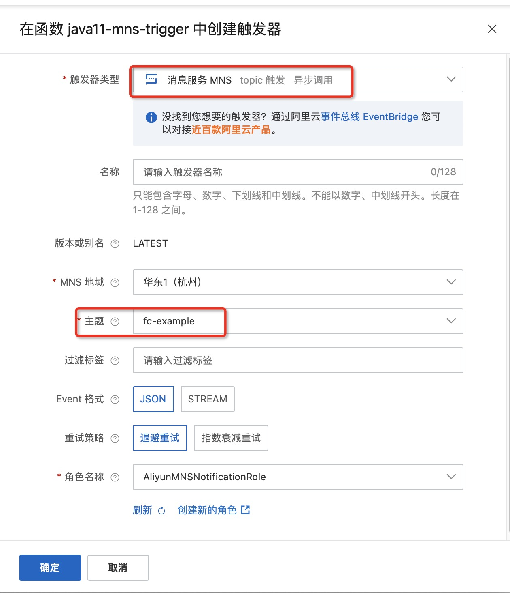

# Nodejs14 消息服务 MNS 触发器示例

本示例为您展示了 nodejs runtime 的 [消息服务MNS](https://help.aliyun.com/document_detail/27414.html) 主题模型触发器示例。
本示例使用了 MNS 的主题模型作为示例，与示例  nodejs-mns-topic-producer 一起实现了消息服务的生产者-消费者模型。
MNS的配置在函数的环境变量配置中（参考s.yaml)。

## 准备开始
- 一个可用的mns主题，可参考MNS官方文档[主题模型快速入门-创建主题](https://help.aliyun.com/document_detail/34424.html) 创建。
- 有 MNS 权限的 RAM 用户
  - 也可参考MNS官方文档[开通消息服务MNS并授权](https://help.aliyun.com/document_detail/27423.html)，函数计算需要该RAM密钥访问MNS主题。
- [可选] 安装并配置 Serverless Devs 工具。（https://help.aliyun.com/document_detail/195474.html）

## 快速开始

### 方式一、使用控制台创建

#### 1. 编译打包

```shell
# 打包文件
cd code && zip -r nodejs-mns-topic-trigger.zip *
```

#### 2. 创建函数
选择服务（或创建服务）后，单击创建函数
- 选择 `从零开始创建`
- 填入函数名称
- 选择运行环境 Node.js 14
- 选择函数触发方式：通过事件请求触发
- 其他设置使用默认

> 详细创建函数流程见文档: [使用控制台创建函数](https://help.aliyun.com/document_detail/51783.html)

#### 3. 使用模拟数据测试
- 3.1 Json类型的测试事件
```json
{
  "TopicOwner":"topic account id",
  "Message":"mock mns message",
  "Subscriber":"subscriber account id",
  "PublishTime":1658235558094,
  "SubscriptionName":"test-5bf13c7e",
  "MessageMD5":"652BF0E6297840015247C3xxxxxxx",
  "TopicName":"fc-example",
  "MessageId":"3405CA51807661353B3xxxxxxxx"
}
```
测试返回结果如下所示：
```bash
{
    "TopicOwner": "topic account id",
    "Message": "mock mns message",
    "Subscriber": "subscriber account id",
    "PublishTime": 1658235558094,
    "SubscriptionName": "test-5bf13c7e",
    "MessageMD5": "652BF0E6297840015247C3xxxxxxx",
    "TopicName": "fc-example",
    "MessageId": "3405CA51807661353B3xxxxxxxx"
}
```

返回日志如下所示
```bash
2022-07-26 16:07:59FC Invoke Start RequestId: 50dac5d6-e7ec-4bb4-8b75-6cfc8a6bxxxx
2022-07-26 16:07:59load code for handler:index.handler
2022-07-26 16:07:592022-07-26 16:07:59 50dac5d6-e7ec-4bb4-8b75-6cfc8a6bxxxx [verbose] event: {
  "TopicOwner":"topic account id",
  "Message":"mock mns message",
  "Subscriber":"subscriber account id",
  "PublishTime":1658235558094,
  "SubscriptionName":"test-5bf13c7e",
  "MessageMD5":"652BF0E6297840015247C3xxxxxxx",
  "TopicName":"fc-example",
  "MessageId":"3405CA51807661353B3xxxxxxxx"
}
2022-07-26 16:07:59FC Invoke End RequestId: 50dac5d6-e7ec-4bb4-8b75-6cfc8a6bxxxx
```

- 3.2 Stream类型的测试事件
```bash
mock mns message
```

测试返回结果如下所示：
```bash
mock mns message
```

返回日志如下所示
```bash
2022-07-26 16:10:25FC Invoke Start RequestId: 841b68b3-1772-40f7-8edb-f5e9a2dbxxxx
2022-07-26 16:10:252022-07-26 16:10:25 841b68b3-1772-40f7-8edb-f5e9a2dbxxxx [verbose] event: mock mns message
2022-07-26 16:10:25FC Invoke End RequestId: 841b68b3-1772-40f7-8edb-f5e9a2dbxxxx
```

#### 4. 配置MNS触发器
- 选择 topic 模型 MNS 触发器
- 选择 JSON 的 Event 格式



> 在创建触发器过程中，页面会提示授权相关信息并让你创建 aliyunmnsnotificationrole  角色，按照页面指导创建即可。

#### 5. 通过MNS控制台触发测试函数


在函数计算控制台查看请求日志，如下所示：
```bash
2022-07-26 16:14:00FC Invoke Start RequestId: 0B6B8B2D-EC20-5404-B041-E0F409F5****
2022-07-26 16:14:002022-07-26 16:14:00 0B6B8B2D-EC20-5404-B041-E0F409F5**** [verbose] event: {"TopicOwner":"14319991xxxxxxxx","Message":"json meesage from MNS console","Subscriber":"14319991xxxxxxxx","PublishTime":1658823240383,"SubscriptionName":"trigger-8000id0i-2d5dxxxx","MessageMD5":"D2DE9F47F7987095172CF5956D85xxxx","TopicName":"fc-example","MessageId":"CC9C55A980767F857E18843AB6BExxxx"}
2022-07-26 16:14:00FC Invoke End RequestId: 0B6B8B2D-EC20-5404-B041-E0F409F5****
```

### 方式二、使用 Serverless Devs 工具编译部署
该方式使用模拟数据进行调用测试

#### 1. 修改 s.yaml 配置

[Yaml完整配置](https://gitee.com/devsapp/fc/blob/main/docs/zh/yaml/readme.md#yaml%E5%AE%8C%E6%95%B4%E9%85%8D%E7%BD%AE)

- 根据需要修改 access 配置

- 添加 [mns 触发器](https://gitee.com/devsapp/fc/blob/main/docs/zh/yaml/triggers.md#mns%E8%A7%A6%E5%8F%91%E5%99%A8) 配置

  ```yaml
        triggers:
          - name: {TriggerName}
            description: ''
            sourceArn: acs:mns:{Region}:{AccountID}:/topics/{TopicName}
            type: mns_topic
            role: acs:ram::{AccountID}:role/aliyunmnsnotificationrole
            qualifier: LATEST
            config:
              filterTag: ''
              notifyContentFormat: JSON
              notifyStrategy: BACKOFF_RETRY
  ```

#### 2. 安装依赖并部署

编译部署代码包
```shell
s deploy
```
#### 3. 使用模拟数据测试

```shell
s invoke --event-file event.json
```

调用函数时收到的响应如下所示：

```bash
========= FC invoke Logs begin =========
FC Invoke Start RequestId: 1096146a-fc44-4005-851a-e7c9b5418684
load code for handler:index.handler
2022-07-26T08:35:16.105Z 1096146a-fc44-4005-851a-e7c9b5418684 [verbose] event: {  "TopicOwner":"topic account id",  "Message":"mock mns message",  "Subscriber":"subscriber account id",  "PublishTime":1658235558094,  "SubscriptionName":"test-5bf13c7e",  "MessageMD5":"652BF0E6297840015247C3xxxxxxx",  "TopicName":"fc-example",  "MessageId":"3405CA51807661353B3xxxxxxxx"}
FC Invoke End RequestId: 1096146a-fc44-4005-851a-e7c9b5418684

Duration: 3.90 ms, Billed Duration: 4 ms, Memory Size: 128 MB, Max Memory Used: 43.86 MB
========= FC invoke Logs end =========

FC Invoke instanceId: c-62dfa743-70936b8abbdb44ab9982

FC Invoke Result:
{  "TopicOwner":"topic account id",  "Message":"mock mns message",  "Subscriber":"subscriber account id",  "PublishTime":1658235558094,  "SubscriptionName":"test-5bf13c7e",  "MessageMD5":"652BF0E6297840015247C3xxxxxxx",  "TopicName":"fc-example",  "MessageId":"3405CA51807661353B3xxxxxxxx"}


End of method: invoke
```

## 注意事项
1. MNS消息服务和函数计算建议部署在同一个地域