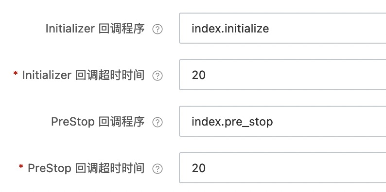
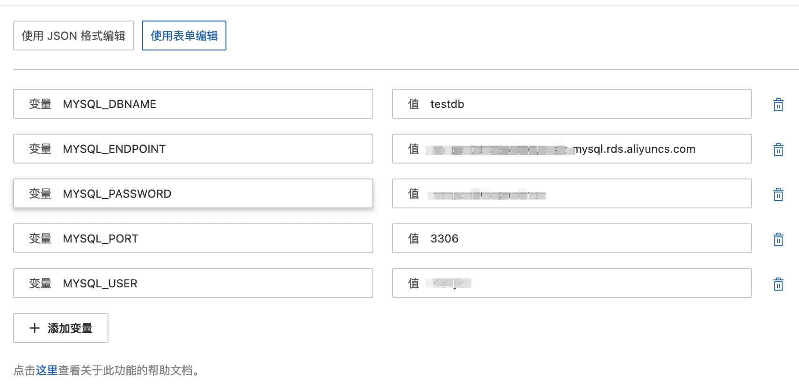
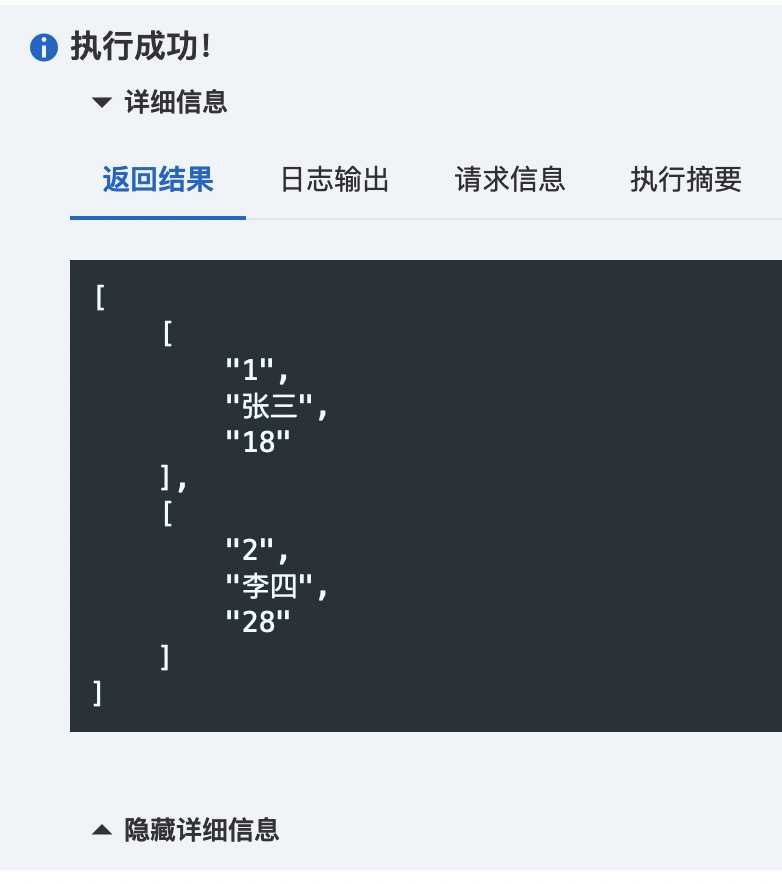

# 使用initializer和preStop回调函数的mysql示例
本示例为您展示了PHP runtime的mysql使用示例。
在本示例中，mysql数据库配置在函数的环境变量配置中（参考s.yaml)，initializer 回调函数从环境变量中获取数据库配置，创建mysql连接并测试连通性，preStop 回调函数负责关闭mysql连接。


## 准备开始
- 一个可用的mysql数据库，可以参考以下sql创建表并插入测试数据

```sql
CREATE TABLE `users` (
  `id` bigint(20) unsigned NOT NULL AUTO_INCREMENT,
  `name` varchar(20) NOT NULL,
  `age` tinyint(11) NOT NULL DEFAULT '0',
  PRIMARY KEY (`id`)
) ENGINE=InnoDB DEFAULT CHARSET=utf8;

INSERT INTO `users` (`id`, `name`, `age`) VALUES
(1, '张三', 18),
(2, '李四', 28);
```

- [可选] 安装并配置 Serverless Devs 工具，以及 docker daemon。（https://help.aliyun.com/document_detail/195474.html）

## 快速开始
### 方式一、使用 Serverless Devs 工具编译部署

#### 1. 修改 s.yaml 配置
- 根据需要修改 access 配置
- 修改 environmentVariables 配置，填入 MYSQL_USER, MYSQL_PASSWORD, MYSQL_ENDPOINT, MYSQL_PORT 和 MYSQL_DBNAME
- 使用 initialize 和 prestop 回调，需要在 s.yaml 中配置

```yaml
        initializationTimeout: 20
        initializer: index.initialize
        instanceLifecycleConfig:
          preStop:
            handler: index.pre_stop
            timeout: 20
        environmentVariables:
          MYSQL_USER: "xxx"       # 设置成你自己的mysql数据库配置
          MYSQL_PASSWORD: "xxx"   # 设置成你自己的mysql数据库配置
          MYSQL_ENDPOINT: "xxx"   # 设置成你自己的mysql数据库配置
          MYSQL_PORT: "xxxxx"     # 设置成你自己的mysql数据库配置
          MYSQL_DBNAME: "xxx"     # 设置成你自己的mysql数据库配置
```

#### 2. 部署

部署代码
```bash
s deploy
```

#### 3. 调用测试

```shell
s invoke
```

调用函数时收到的响应如下所示：

```bash
========= FC invoke Logs begin =========
FC Initialize Start RequestId: cf24b6be-f862-466c-bec4-xxxxxxxxxxxx
2022-06-14T19:38:xxZ cf24b6be-f862-466c-bec4-xxxxxxxxxxxx [INFO] initializing done
FC Initialize End RequestId: cf24b6be-f862-466c-bec4-xxxxxxxxxxxx
FC Invoke Start RequestId: cf24b6be-f862-466c-bec4-xxxxxxxxxxxx
FC Invoke End RequestId: cf24b6be-f862-466c-bec4-xxxxxxxxxxxx

Duration: 6.50 ms, Billed Duration: 7 ms, Memory Size: 128 MB, Max Memory Used: 42.37 MB
========= FC invoke Logs end =========

FC Invoke instanceId: c-62a8e3cc-xxxxxxxxxxxxxxxxxxxx

FC Invoke Result:
[["1","张三","18"],["2","李四","28"]]


End of method: invoke
```

### 方式二、使用控制台创建

#### 1. 部署代码包

```shell
# 打包文件
cd code && zip -r php72-mysql.zip *
```

创建函数并上传代码包

#### 2. 设置initializer/preStop回调函数配置和环境变量配置

回调函数配置



环境变量配置



#### 3. 调用测试


## 数据库访问限制
当使用云数据库时，一般都会有访问控制，比如阿里云数据库RDS中的白名单设置（ [RDS白名单设置说明](https://help.aliyun.com/document_detail/43185.html?spm=5176.19908528.help.dexternal.6c721450iLu0jH) )。

如果仅仅作为测试，可以将白名单配置成 `0.0.0.0/0`。（不要在生产环境使用!)

在生产环境，可以使用以下两种方式访问：

1. VPC方式（**推荐**） <br>
参考文档：https://help.aliyun.com/document_detail/84514.html
2. 代理方式<br>
参考文档：https://help.aliyun.com/document_detail/91243.html

## 备注
1. 本示例仅作为FC连接数据库的演示用例，请勿直接用于生产环境。
