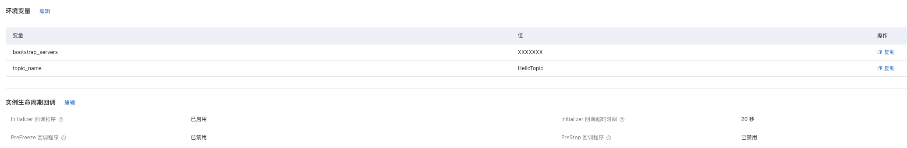

# Golang Kafka message queue producer example

This example shows you the producer example of Golang's [Message Queue Kafka](https://help.aliyun.com/document_detail/68151.html?spm=5176.167616.J_5253785160.5.2dfe6feexRPqMj). (See Kafka Trigger Example for Consumer Example)

This example uses [Message Queue Kafka version official Golang SDK](https://help.aliyun.com/document_detail/183934.html).

 ## ready to start

 - For an available Kafka message queue, please refer to the official document of message queue Kafka version [Quick Start of Message Queue](https://help.aliyun.com/document_detail/99949.html).

   - Create a VPC private network (VPC is recommended in the production environment), please refer to [VPC official document](https://help.aliyun.com/document_detail/65398.htm?spm=a2c4g.11186623.0.0.61be4c9d4aGfpg# task-1012575). VPC console [link](https://vpcnext.console.aliyun.com/). At this point, you can have a VPC and corresponding switches.

   > When deploying a Kafka instance, you will be prompted to create an available VPC private network

 - Ability to compile CGO programs to a Linux/amd64 environment (how to be described in the next section)

 - [Optional] Install and configure Serverless Devs tools. (https://help.aliyun.com/document_detail/195474.html)

 ## quick start

 ### Method 1. Use the console to create

 #### 1. Install dependencies and deploy code packages

> For more details on Function Compute's deployment of Go code packages, see (https://help.aliyun.com/document_detail/418490.html)
>
> How to achieve cross-platform compilation for projects containing CGO code (https://segmentfault.com/a/1190000038938300)

Since the Kafka client package includes CGO, although Go has a cross-compiler, if the corresponding toolchain for cross-compiling C is not installed, a cross-platform executable cannot be directly compiled. That is, when we use CGO, in order to achieve cross-platform compilation, we need to make C/C++ code also support cross-platform. Here are 3 solutions:

- Compile directly with Linux/amd64 platform machine

  - ```shell
    # Open CGO directly and compile
    CGO_ENABLED=1 GOOS=linux GOARCH=amd64 go build main.go
    ````

- Possible solutions under Mac:

  - ```shell
    # Download the linux compilation toolchain
    brew install FiloSottile/musl-cross/musl-cross
    CGO_ENABLED=1 GOOS=linux GOARCH=amd64 CC=x86_64-linux-musl-gcc CGO_LDFLAGS="-static" go build -a -v -tags musl
    ````

- Common solutions for each platform (Docker):

  - ```shell
    # pull image
    docker pull karalabe/xgo-latest
    # Run in the code directory:
    docker run -v $(pwd):/go/src/gocode -w /go/src/gocode --entrypoint='' karalabe/xgo-latest /bin/bash -c "CGO_ENABLED=1 GOOS=linux GOARCH=amd64 go build main.go"
    # The command to run is compiled in the container, and the compiled executable file can be viewed in the host code directory
    ````

Finally, compress the executable file.


 #### 2. Create service

It is recommended to create services in the same Region of the Kafka instance.

When creating a service, select AliyunFcDefaultRole in `Service Role` in `Advanced Options` (if not, create a corresponding role according to the prompts), and enable `Allow access to VPC`, and select `VPC' and `Switch when creating a Kafka instance. ` and the corresponding `security group (created automatically after the Kafka instance is deployed)`.


#### 3. Create function

 After creating the service, click Create Function as shown

 - Select `Create from scratch with standard Runtime`
 - Fill in the function name
 - Select the code upload method `Upload code via zip package` to upload the corresponding code zip package
 - Select the runtime environment Go 1
 - Select function trigger method: trigger by event request
 - Use default for other settings

 > For the detailed function creation process, see the document: [Create a function using the console](https://help.aliyun.com/document_detail/51783.html)


#### 4. Configure environment variables and instance lifecycle callbacks

Set environment variables in the `function configuration` module in the function details and enable the Initializer and PreStop callback procedures in the instance lifecycle callback.

Where environment variables:

- BOOTSTRAP_SERVERS is set to the `default access point` address corresponding to the `access point information` in the Kafka instance details.

- TOPIC_NAME is set to the topic to which the corresponding message is sent (need to be created in advance in the Kafka message queue version)




 #### 5. Test function

For the Go test, the parameters need to be configured in json format with the key value of "Key" ("Key" is set in the demo program and can be modified), such as:

````json
{
    "Key": "test go"
}
````

Log output result:

 ```bash
2022/07/31 04:27:48.315016 start
FC Initialize Start RequestId: f1326a21-5f69-4090-8283-beb458b2d257
2022-07-31 12:27:48 f1326a21-5f69-4090-8283-beb458b2d257 [INFO] main.go:37: Initializing the kafka config
FC Initialize End RequestId: f1326a21-5f69-4090-8283-beb458b2d257
FC Invoke Start RequestId: 7e7931d4-3f62-452e-86a7-4f8190bbabb7
2022-07-31 12:27:49 7e7931d4-3f62-452e-86a7-4f8190bbabb7 [INFO] main.go:57: sending the message to kafka: test go!
2022-07-31 12:27:49 7e7931d4-3f62-452e-86a7-4f8190bbabb7 [INFO] main.go:72: Delivered message to topic HelloTopic [9] at offset 23
FC Invoke End RequestId: 7e7931d4-3f62-452e-86a7-4f8190bbabb7

 ````


 ### Method 2. Compile and deploy using Serverless Devs tools

 #### 1. Modify s.yaml configuration

- Modify region, serviceName, functionName (set the same region as the Kafka instance)

- According to different platforms, modify the run command in pre-dploy. If it is a mac platform, set run to `CGO_ENABLED=1 GOOS=linux GOARCH=amd64 CC=x86_64-linux-musl-gcc CGO_LDFLAGS after installing the corresponding linux toolchain ="-static" go build -a -v -tags musl`.
- Modify vpcConfig, and fill in the VPC ID, security group ID (which can be found in the `Network and Security` menu item of the **ECS** console) and vSwitchID corresponding to the Kafka instance.
- Modify the environmentVariables configuration, fill in BOOTSTRAP_SERVERS and TOPIC_NAME

 #### 2. Install dependencies and deploy

 Install dependent libraries

 ```shell
# Use the s tool to install dependencies, you need to use docker
s build --use-docker
 ````

 deploy code

 ```bash
s deploy -y
 ````

 #### 3. Invoke the test

 ```shell
s invoke -e '{
    "Key": "test go serverless devs"
}'
 ````

 The response received when calling the function looks like this:

 ```bash
========= FC invoke Logs begin =========
2022/07/31 04:37:27.116361 start
FC Initialize Start RequestId: 85422744-98de-42a5-b9d6-67f3344f832d
2022-07-31T04:37:27.149Z 85422744-98de-42a5-b9d6-67f3344f832d [INFO] main.go:37: Initializing the kafka config
FC Initialize End RequestId: 85422744-98de-42a5-b9d6-67f3344f832d
FC Invoke Start RequestId: 85422744-98de-42a5-b9d6-67f3344f832d
2022-07-31T04:37:28.239Z 85422744-98de-42a5-b9d6-67f3344f832d [INFO] main.go:57: sending the message to kafka: test go serverless devs!
2022-07-31T04:37:28.249Z 85422744-98de-42a5-b9d6-67f3344f832d [INFO] main.go:72: Delivered message to topic HelloTopic [9] at offset 24
FC Invoke End RequestId: 85422744-98de-42a5-b9d6-67f3344f832d

Duration: 1001.97 ms, Billed Duration: 1002 ms, Memory Size: 128 MB, Max Memory Used: 16.16 MB
========= FC invoke Logs end =========

FC Invoke instanceId: c-62e60706-413948b4cb5d4ed18c78

FC Invoke Result:
"Finish sending the message to kafka: test go serverless devs!"


End of method: invoke
 ````
