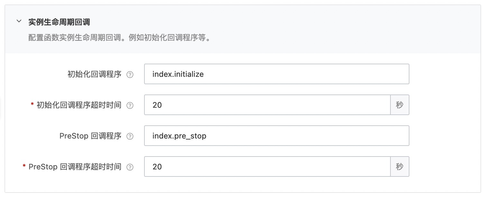

# golang mysql 数据库示例
快速部署一个 golang 1.x 的 Event 类型的读写 Mysql 数据库函数到阿里云函数计算。在本案例中提供公网方式连接到 RDS MySQL数据库。

## 前期准备
使用该项目，推荐您拥有以下的产品权限 / 策略：

| 服务/业务 | 函数计算 |     
| --- |  --- |   
| 权限/策略 | AliyunFCFullAccess |

使用该项目，您需要提前准备好 MySQL 数据库并执行以下 SQL 语句创建表:
  ```sql
    CREATE TABLE `users` (
      `id` bigint(20) unsigned NOT NULL AUTO_INCREMENT,
      `name` varchar(20) NOT NULL,
      `age` tinyint(11) NOT NULL DEFAULT '0',
      PRIMARY KEY (`id`)
    ) ENGINE=InnoDB DEFAULT CHARSET=utf8;
  ```
 MySQL 数据库既可以选择阿里云 MySQL 数据库也可以选择其它 MySQL 数据库。在本案例中我们使用公网方式连接到阿里云 MySQL 数据库，若使用vpc方式连接阿里云 MySQL 数据库，请参考文档[配置网络](https://help.aliyun.com/document_detail/72959.html)配置VPC网络。
- 使用阿里云数据库RDS MySQL实例,创建教程可以参考[这里](https://help.aliyun.com/document_detail/26117.htm?spm=a2c4g.11186623.0.0.12a47634PzmWPx)
  - 登陆 RDS 控制台为 MySQL 实例[申请外网地址](https://help.aliyun.com/document_detail/26128.html),便于公网访问数据库
  - [设置 IP 白名单](https://help.aliyun.com/document_detail/96118.html),本案例作为测试，可以将白名单配置成 0.0.0.0/0。（不要在生产环境使用!)
  - 需要提供正确的数据库 URL 地址、数据库名称、用户、密码，用于连接数据库
- 使用其它 MySQL 数据库
  - 需要提供正确的数据库 URL 地址、数据库名称、用户、密码，用于连接数据库

## 快速开始

### 方式一、使用控制台创建

#### 1. 编译打包

```shell
# 编译部署
GOOS=linux GOARCH=amd64 go build main.go
# 打包文件
zip main.zip main
```

> 以上命令只适用于 Linux/Mac 环境，Windows 环境可参考官方文档: [在 Windows 下编译打包](https://help.aliyun.com/document_detail/418490.html#section-qfg-n9c-m9v)

创建函数并上传代码包

#### 2. 设置initializer/preStop回调函数配置和环境变量配置

回调函数配置


环境变量配置


#### 3. 调用测试

返回结果如下所示:

```bash
{3 wanger 38}
```

日志内容如下:

```bash
2022-07-28 01:18:352022/07/27 17:18:35.532031 start
2022-07-28 01:18:35FC Initialize Start RequestId: 90e4e980-0772-4682-9b14-51319a20xxxx
2022-07-28 01:18:35FC Initialize End RequestId: 90e4e980-0772-4682-9b14-51319a20xxxx
2022-07-28 01:18:35FC Invoke Start RequestId: 90e4e980-0772-4682-9b14-51319a20xxxx
2022-07-28 01:18:352022/07/27 17:18:35.735864 New data ID added to the database is：3
2022-07-28 01:18:352022/07/27 17:18:35.770229 user: {3 wanger 38}
2022-07-28 01:18:35FC Invoke End RequestId: 90e4e980-0772-4682-9b14-51319a20xxxx
2022-07-28 01:18:35FC PreStop Start RequestId: 9b813de1-e3db-4be3-95c7-71b90d70xxxx
2022-07-28 01:18:35FC PreStop End RequestId: 9b813de1-e3db-4be3-95c7-71b90d70xxxx
```

### 方式二、使用 Serverless Devs 工具编译部署

#### 1. 修改 s.yaml 配置
- 根据需要修改 access 配置
- 修改 environmentVariables 配置，填入 MYSQL_USER, MYSQL_PASSWORD, MYSQL_ENDPOINT, MYSQL_PORT 和 MYSQL_DBNAME

环境变量

| 参数名称 | 参数类型 | 是否必填 | 例子 |   参数含义 | 
| --- |  --- |  --- | --- | --- |
| MYSQL_ENDPOINT | String | 必填 | rm-uf6rrswxxxxxxxxxxxx.mysql.rds.aliyuncs.com |   数据库网址，用于连接数据库 |
| MYSQL_PORT | String | 必填 | 3306 |   数据库端口 | 
| MYSQL_DBNAME | String | 必填 | test |   数据库名称 | 
| MYSQL_USER | String | 必填 | fc |   数据库用户名 |  
| MYSQL_PASSWORD | String | 必填 | xxxxxxxx |   数据库密码 |  

#### 2. 部署

编译部署代码包
```shell
s deploy
```

#### 3. 调用测试

- 使用 [Serverless Devs Cli](https://www.serverless-devs.com/serverless-devs/install) 调试
  - 运行 `s invoke ` 进行远程调试
  - 调用函数时收到的响应如下所示:
    ```bash
    ========= FC invoke Logs begin =========
    2022/07/27 17:03:53.658138 start
    FC Initialize Start RequestId: f4a2f08e-d412-413b-a681-13908d6fxxxx
    FC Initialize End RequestId: f4a2f08e-d412-413b-a681-13908d6fxxxx
    FC Invoke Start RequestId: 81f1b61a-a34c-4154-b263-6a19f97cxxxx
    2022/07/27 17:03:57.722069 New data ID added to the database is：3
    2022/07/27 17:03:57.756517 user: {3 wanger 38}
    FC Invoke End RequestId: 81f1b61a-a34c-4154-b263-6a19f97cxxxx
    Duration: 210.07 ms, Billed Duration: 211 ms, Memory Size: 128 MB, Max Memory Used: 9.93 MB
    ========= FC invoke Logs end =========
    FC Invoke instanceId: c-62e16ff9-c72ead5ed6814729xxxx
    FC Invoke Result:
    user: {3 wanger 38}
    End of method: invoke
      ```
- 端对端测试
  - 登陆 FC 控制台并测试函数
  - 控制台返回结果如下所示:
    ```bash
    user: {3 wanger 38}
    ```

## 数据库访问限制
  - 使用云数据库时，一般都会有访问控制，需要[设置 IP 白名单](https://help.aliyun.com/document_detail/96118.html),本案例作为测试，可以将白名单配置成 0.0.0.0/0。（不要在生产环境使用!)。
  - 在生产环境，可以使用以下两种方式访问：
    - VPC方式（**推荐**） 
    参考文档：[配置网络](https://help.aliyun.com/document_detail/72959.html)
    - 公网方式
    参考文档：[配置固定公网IP地址](https://help.aliyun.com/document_detail/410740.html)

本应用仅作为学习和参考使用，您可以基于本项目进行二次开发和完善，实现自己的业务逻辑

## 常见问题
- 未设置白名单，MySQL 网址或端口设置错误
    ```bash
     "errorMessage": "dial tcp: lookup rm-uf6rrsxxxxxxxxxxxxxxx.mysql.rds.aliyuncs.com on 21.0.xx.xx:53: no such host",
    ```
- MySQL 用户名、密码错误
    ```bash
     "errorMessage": "(1045, \"Access denied for user 'fc1'@'120.xx.xx.xx' (using password: YES)\")"
    ```
- MySQL 数据库名称错误
    ```bash
     "errorMessage": "(1049, \"Unknown database 'users1'\")"
    ```      