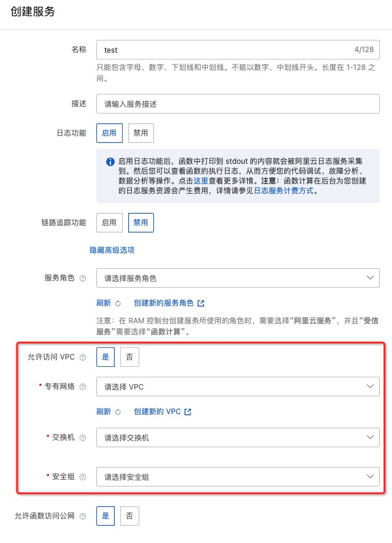

# Java11 Kafka消息队列生产者示例

本示例为您展示了 Java11 的 [消息队列Kafka](https://help.aliyun.com/document_detail/68151.html?spm=5176.167616.J_5253785160.5.2dfe6feexRPqMj) 生产者示例。（消费者示例见Kafka触发器示例）

本示例使用[消息队列Kafka版官方Java SDK](https://help.aliyun.com/document_detail/68325.html)。

 ## 准备开始

 - 一个可用的Kafka消息队列，可参考消息队列Kafka版官方文档[消息队列快速入门](https://help.aliyun.com/document_detail/99949.html)。

   - 创建VPC专有网络（推荐在生产环境中也使用VPC），可参考[VPC官方文档](https://help.aliyun.com/document_detail/65398.htm?spm=a2c4g.11186623.0.0.61be4c9d4aGfpg#task-1012575)。VPC控制台[链接](https://vpcnext.console.aliyun.com/)。至此即可拥有VPC和相应交换机。

   > 部署Kafka实例时会提示创建可用的VPC专有网络

 - [可选] 安装并配置 Serverless Devs 工具。(https://help.aliyun.com/document_detail/195474.html)

 ## 快速开始

 ### 方式一. 使用控制台创建

#### 1. 安装依赖和部署代码包

```shell
# 安装依赖并编译为jar包，对应jar包将在target目录下
mvn clean package
```


 #### 2. 创建服务

推荐在Kafka实例相同Region创建服务。

创建服务时在`高级选项`中`服务角色`选择AliyunFcDefaultRole（如没有则根据提示创建相应角色），并开启`允许访问VPC`，选取创建Kafka实例时所选择的`专有网络`、`交换机`与对应的`安全组(Kafka实例部署后自动创建)`。




#### 3. 创建函数

  创建服务后，单击创建函数
 - 选择 `使用标准 Runtime 从零创建`
 - 填入函数名称
 - 代码上传方式选择`通过jar包上传代码`上传相应jar压缩包
 - 选择运行环境 Java 11
 - 选择函数触发方式：通过事件请求触发
 - 其他设置使用默认

 > 详细创建函数流程见文档: [使用控制台创建函数](https://help.aliyun.com/document_detail/51783.html)


#### 4. 配置环境变量与实例生命周期回调

在函数详情中的`函数配置`模块设置环境变量并在实例生命周期回调中配置Initializer 回调程序。

其中环境变量：

- BOOTSTRAP_SERVERS设置为Kafka实例详情内`接入点信息`对应的`默认接入点`地址。
- TOPIC_NAME设置为相应发送消息到的Topic（需要在Kafka消息队列版中提前创建）

Initializer设置为example.App::initialize


 #### 5. 测试函数

 返回结果如下所示
 ```bash
 Produce ok: HelloTopic-6@20
  Payload: {
     "key1": "value1",
     "key2": "value2",
     "key3": "value3"
 }
 ```


 ### 方式二. 使用 Serverless Devs 工具编译部署

 #### 1. 修改 s.yaml 配置

- 修改region、serviceName、functionName（设置和Kafka实例相同的region）

- 修改vpcConfig，将Kafka实例对应的VPC ID、安全组ID、vSwitchID填入。

- 修改 environmentVariables 配置，填入 BOOTSTRAP_SERVERS 和 TOPIC_NAME


 #### 2. 安装依赖并部署

 安装依赖库

 ```shell
# 使用s工具安装依赖，需要使用 docker
s build --use-docker
 ```

 部署代码

 ```bash
s deploy -y
 ```

 #### 3. 调用测试

 ```shell
s invoke -e '{
    "Key": "test java serverless devs"
}'
 ```

 调用函数时收到的响应如下所示：

 ```bash
========= FC invoke Logs begin =========
FC Initialize Start RequestId: 951d096c-d9d9-4105-806b-d350f31786c9
[Name] Register [com.aliyun.serverless.runtime.classloader.FunctionClassLoader@58372a00] as [com.aliyun.serverless.runtime.classloader.FunctionClassLoader@com.aliyun.serverless.runtime.classloader.FunctionClassLoader@/code/HelloFCJavaKafka-1.0-SNAPSHOT.jar/code/original-HelloFCJavaKafka-1.0-SNAPSHOT.jar]: hash [d4d9f0d4] (normal mode)
SLF4J: Failed to load class "org.slf4j.impl.StaticLoggerBinder".
SLF4J: Defaulting to no-operation (NOP) logger implementation
SLF4J: See http://www.slf4j.org/codes.html#StaticLoggerBinder for further details.
FC Initialize End RequestId: 951d096c-d9d9-4105-806b-d350f31786c9
FC Invoke Start RequestId: 951d096c-d9d9-4105-806b-d350f31786c9
2022-08-08 09:41:44.123 [INFO] [951d096c-d9d9-4105-806b-d350f31786c9] Produce ok: HelloTopic-10@18
 Payload: {
	"Key": "test java serverless devs"
}
FC Invoke End RequestId: 951d096c-d9d9-4105-806b-d350f31786c9
========= FC invoke Logs end =========

FC Invoke instanceId: c-62e61808-256d56a4065243eb9951

FC Invoke Result:
Produce ok: HelloTopic-10@18
 Payload: {
    "Key": "test java serverless devs"
}


End of method: invoke
 ```

