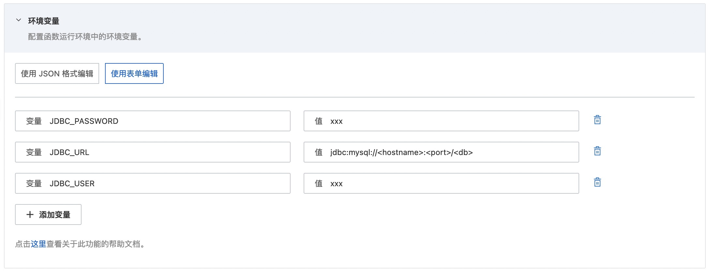

# java11 mysql示例

快速部署一个 java11 的 HTTP 类型的读写 Mysql 数据库函数到阿里云函数计算。在本案例中提供公网方式连接到 RDS MySQL数据库。

## 前期准备
使用该项目，推荐您拥有以下的产品权限 / 策略：

| 服务/业务 | 函数计算 |     
| --- |  --- |   
| 权限/策略 | AliyunFCFullAccess |

使用该项目，您需要提前准备好 MySQL 数据库并执行以下 SQL 语句创建表:
  ```sql
    CREATE TABLE `users` (
      `id` bigint(20) unsigned NOT NULL AUTO_INCREMENT,
      `name` varchar(20) NOT NULL,
      `age` tinyint(11) NOT NULL DEFAULT '0',
      PRIMARY KEY (`id`)
    ) ENGINE=InnoDB DEFAULT CHARSET=utf8;
  ```
 MySQL 数据库既可以选择阿里云 MySQL 数据库也可以选择其它 MySQL 数据库。在本案例中我们使用公网方式连接到阿里云 MySQL 数据库，若使用vpc方式连接阿里云 MySQL 数据库，请参考文档[配置网络](https://help.aliyun.com/document_detail/72959.html)配置VPC网络。
- 使用阿里云数据库RDS MySQL实例,创建教程可以参考[这里](https://help.aliyun.com/document_detail/26117.htm?spm=a2c4g.11186623.0.0.12a47634PzmWPx)
  - 登陆 RDS 控制台为 MySQL 实例[申请外网地址](https://help.aliyun.com/document_detail/26128.html),便于公网访问数据库
  - [设置 IP 白名单](https://help.aliyun.com/document_detail/96118.html),本案例作为测试，可以将白名单配置成 0.0.0.0/0。（不要在生产环境使用!)
  - 需要提供正确的数据库 URL 地址、数据库名称、用户、密码，用于连接数据库
- 使用其它 MySQL 数据库
  - 需要提供正确的数据库 URL 地址、数据库名称、用户、密码，用于连接数据库

## 快速开始
### 方式一、使用控制台创建

#### 1. 编译打包

```shell
# 编译部署
mvn package
# 打包文件
cd target && zip -r java11-mysql.zip *
```

#### 2. 创建函数
选择服务（或创建服务）后，单击创建函数，如图所示
- 选择 `从零开始创建`
- 填入函数名称
- 选择运行环境 java11/java8
- 选择函数触发方式：通过事件请求触发
- 其他设置使用默认


> 详细创建函数流程见文档: [使用控制台创建函数](https://help.aliyun.com/document_detail/51783.html)

#### 3. 设置initializer/preStop回调函数配置和环境变量配置

回调函数配置


环境变量配置



#### 4. 测试函数


### 方式二、使用 Serverless Devs 工具编译部署

#### 1. 修改 s.yaml 配置
- 根据需要修改 access 配置
- 修改 environmentVariables 配置，填入 JDBC_URL, JDBC_USER 和 JDBC_PASSWORD

环境变量

| 参数名称 | 参数类型 | 是否必填 | 例子 |   参数含义 | 
| --- |  --- |  --- | --- | --- |
| MYSQL_ENDPOINT | String | 必填 | rm-uf6rrswxxxxxxxxxxxx.mysql.rds.aliyuncs.com |   数据库网址，用于连接数据库 |
| MYSQL_PORT | String | 必填 | 3306 |   数据库端口 | 
| MYSQL_DBNAME | String | 必填 | test |   数据库名称 | 
| MYSQL_USER | String | 必填 | fc |   数据库用户名 |  
| MYSQL_PASSWORD | String | 必填 | xxxxxxxx |   数据库密码 |  

#### 2. 部署

```shell
s deploy
```

#### 3. 调用测试
- 代码测试
  - 通过postman构造http请求
  - 登陆函数控制台->服务->函数管理->触发器管理->配置信息->公网访问地址,粘贴公网地址
    
  - 在postman构造请求，粘贴公网访问地址，其中request body需包含想要插入数据库的 JSON 格式内容，包含用户名字和年龄字段。
    ```
    {
      "name": "wanger",
      "age": "12"
    }
    ```
  - 通过 POST 方法发送请求
  - 结果如下所示:
    
如果用户不熟悉postman工具也可直接在控制台编辑测试用例
  
## 数据库访问限制
  - 使用云数据库时，一般都会有访问控制，需要[设置 IP 白名单](https://help.aliyun.com/document_detail/96118.html),本案例作为测试，可以将白名单配置成 0.0.0.0/0。（不要在生产环境使用!)。
  - 在生产环境，可以使用以下两种方式访问：
    - VPC方式（**推荐**） 
    参考文档：[配置网络](https://help.aliyun.com/document_detail/72959.html)
    - 公网方式
    参考文档：[配置固定公网IP地址](https://help.aliyun.com/document_detail/410740.html)
  - 本示例不是连接池方式，若要使用连接池，可以参考文档 [Connection Pooling with Connector/J](https://dev.mysql.com/doc/connector-j/8.0/en/connector-j-usagenotes-j2ee-concepts-connection-pooling.html)


本应用仅作为学习和参考使用，您可以基于本项目进行二次开发和完善，实现自己的业务逻辑

## 常见问题
- 未设置白名单，MySQL 网址或端口设置错误
    ```bash
     "errorMessage": "Communications link failure\n\nThe last packet sent successfully to the server was 0 milliseconds ago. The driver has not received any packets from the server."
    ```
- MySQL 用户名、密码错误
    ```bash
     "errorMessage": "Access denied for user 'fc'@'120.76.207.131' (using password: YES)"
    ```
- MySQL 数据库名称错误
    ```bash
     "errorMessage": "Unknown database 'users1'"