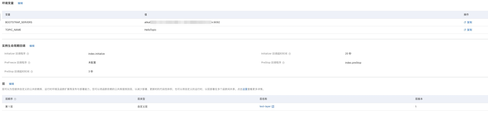

# Nodejs14 Kafka message queue producer example

This example shows you Nodejs14's [Message Queue Kafka](https://help.aliyun.com/document_detail/68151.html?spm=5176.167616.J_5253785160.5.2dfe6feexRPqMj) producer example. (See Kafka Trigger Example for Consumer Example)

This example uses the [Message Queue Kafka Version Official Nodejs SDK](https://help.aliyun.com/document_detail/184266.html).

 ## ready to start

 - For an available Kafka message queue, please refer to the official document of message queue Kafka version [Quick Start of Message Queue](https://help.aliyun.com/document_detail/99949.html).

   - Create a VPC private network (VPC is recommended in the production environment), please refer to [VPC official document](https://help.aliyun.com/document_detail/65398.htm?spm=a2c4g.11186623.0.0.61be4c9d4aGfpg# task-1012575). VPC console [link](https://vpcnext.console.aliyun.com/). At this point, you can have a VPC and corresponding switches.

   > When deploying a Kafka instance, you will be prompted to create an available VPC private network

 - [Optional] Install and configure Serverless Devs tools. (https://help.aliyun.com/document_detail/195474.html)

 ## quick start

 ### Method 1. Use the console to create

#### 1. Install dependencies and deploy code packages

For Nodejs, it is recommended to use `layer` to deploy dependencies.

In the advanced functions on the left menu bar of the Function Compute console, select `Layer Management`. Select Nodejs14 for the compatible runtime, select `Online Build Dependency Layer` for the layer upload method, and copy the package.json file into it. Finally, wait for the layer to be created.


For the code, just package and compress it in the code directory:

```shell
zip code.zip -r ./*
````


 #### 2. Create service

It is recommended to create services in the same Region of the Kafka instance.

When creating a service, select AliyunFcDefaultRole in `Service Role` in `Advanced Options` (if not, create a corresponding role according to the prompts), and enable `Allow access to VPC`, and select `VPC' and `Switch when creating a Kafka instance. ` and the corresponding `security group (created automatically after the Kafka instance is deployed)`.


#### 3. Create function

  After creating the service, click Create Function as shown

 - Select `Create from scratch with standard Runtime`
 - Fill in the function name
 - Select the code upload method `Upload code via zip package` to upload the corresponding code zip package
 - Select the runtime environment Nodejs 14
 - Select function trigger method: trigger by event request
 - Use default for other settings

 > For the detailed function creation process, see the document: [Create a function using the console](https://help.aliyun.com/document_detail/51783.html)


#### 4. Configure environment variables, instance lifecycle callbacks and layers

Set environment variables in the `Function Configuration` module in the function details and configure the Initializer callback procedure in the instance lifecycle callback.

Where environment variables:

- BOOTSTRAP_SERVERS is set to the `default access point` address corresponding to the `access point information` in the Kafka instance details.
- TOPIC_NAME is set to the topic to which the corresponding message is sent (need to be created in advance in the Kafka message queue version)

Initializer is set to index.initialize;
The PreStop callback procedure is set to index.preStop;

Layer editor adds previously built dependency layers.




 #### 5. Test function

 The returned results are as follows:

 ```bash
Finish sending the message:{
    "key1": "value1",
    "key2": "value2",
    "key3": "value3"
}
 ````

The log output is as follows:

```bash
FC Initialize Start RequestId: 9b230404-4e05-49ca-a3d6-3be4629b367f
load code for handler: index.initialize
2022-07-31 14:30:31 9b230404-4e05-49ca-a3d6-3be4629b367f [verbose] Servers: alikafka-pre-cn-7mz2sr1xa00c-1-vpc.alikafka.aliyuncs.com:9092
2022-07-31 14:30:31 9b230404-4e05-49ca-a3d6-3be4629b367f [verbose] TopicName: HelloTopic
FC Initialize End RequestId: 9b230404-4e05-49ca-a3d6-3be4629b367f
FC Invoke Start RequestId: 3f19de00-ab31-48b4-a386-03cded9f97ee
load code for handler:index.handler
2022-07-31 14:30:31 3f19de00-ab31-48b4-a386-03cded9f97ee [verbose] connect ok
2022-07-31 14:30:36 3f19de00-ab31-48b4-a386-03cded9f97ee [verbose] delivery-report: producer ok
FC Invoke End RequestId: 3f19de00-ab31-48b4-a386-03cded9f97ee
````

 ### Method 2. Compile and deploy using Serverless Devs tools

 #### 1. Modify s.yaml configuration

- Modify region, serviceName, functionName (set the same region as the Kafka instance)

- Modify vpcConfig and fill in the VPC ID, security group ID, and vSwitchID corresponding to the Kafka instance.

- Modify the environmentVariables configuration, fill in BOOTSTRAP_SERVERS and TOPIC_NAME


 #### 2. Install dependencies and deploy

 Install dependent libraries

 ```shell
# Use the s tool to install dependencies, you need to use docker
s build --use-docker
 ````

 deploy code

 ```bash
s deploy -y
 ````

 #### 3. Invoke the test

 ```shell
s invoke -e '{
    "Key": "test nodejs14 serverless devs"
}'
 ````

 The response received when calling the function looks like this:

 ```bash
========= FC invoke Logs begin =========
FC Initialize Start RequestId: f9f17f0b-62fb-4ffa-853a-67fb316e0bf1
load code for handler: index.initialize
2022-07-31T06:22:37.562Z f9f17f0b-62fb-4ffa-853a-67fb316e0bf1 [verbose] Servers: alikafka-pre-cn-7mz2sr1xa00c-3-vpc.alikafka.aliyuncs.com:9092
2022-07-31T06:22:37.562Z f9f17f0b-62fb-4ffa-853a-67fb316e0bf1 [verbose] TopicName: HelloTopic
FC Initialize End RequestId: f9f17f0b-62fb-4ffa-853a-67fb316e0bf1
FC Invoke Start RequestId: f9f17f0b-62fb-4ffa-853a-67fb316e0bf1
load code for handler:index.handler
2022-07-31T06:22:37.621Z f9f17f0b-62fb-4ffa-853a-67fb316e0bf1 [verbose] connect ok
2022-07-31T06:22:37.951Z f9f17f0b-62fb-4ffa-853a-67fb316e0bf1 [verbose] delivery-report: producer ok
FC Invoke End RequestId: f9f17f0b-62fb-4ffa-853a-67fb316e0bf1

Duration: 10006.34 ms, Billed Duration: 10007 ms, Memory Size: 128 MB, Max Memory Used: 53.24 MB
========= FC invoke Logs end =========

FC Invoke instanceId: c-62e61fad-012cb0b0300d462b817a

FC Invoke Result:
Finish sending the message:{
    "Key": "test nodejs14 serverless devs"
}


End of method: invoke
 ````
