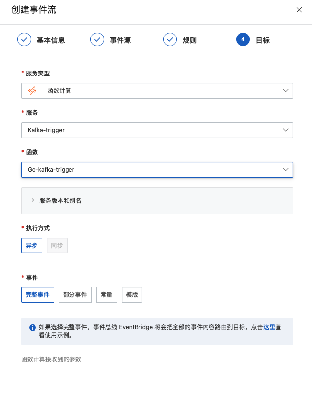

# Nodejs14 Kafka消息队列触发器示例

本示例为您展示了 Nodejs14  [消息队列Kafka](https://help.aliyun.com/document_detail/68151.html?spm=5176.167616.J_5253785160.5.2dfe6feexRPqMj) 消息读取示例。

本示例使用了Kafka消息队列作为示例，与函数计算中的消息队列Kafka版触发器一起实现了消息队列的读取。


 ## 准备开始

 - 一个可用的Kafka消息队列，可参考消息队列Kafka版官方文档[消息队列快速入门](https://help.aliyun.com/document_detail/99949.html)。

   - 创建VPC专有网络（推荐在生产环境中也使用VPC），可参考[VPC官方文档](https://help.aliyun.com/document_detail/65398.htm?spm=a2c4g.11186623.0.0.61be4c9d4aGfpg#task-1012575)。VPC控制台[链接](https://vpcnext.console.aliyun.com/)。至此即可拥有VPC和相应交换机。

   > 部署Kafka实例时会提示创建可用的VPC专有网络

 - [可选] 安装并配置 Serverless Devs 工具。(https://help.aliyun.com/document_detail/195474.html)

 ## 快速开始

 ### 方式一. 使用控制台创建

#### 1. 安装依赖和部署代码包

本示例无依赖包。

对于代码只需在code目录下打包压缩即可：

```shell
zip code.zip -r ./*
```


 #### 2. 创建服务

推荐在Kafka实例相同Region创建服务。

 #### 3. 创建函数

 选择服务（或创建服务）后，单击创建函数，如图所示

 - 选择 `从零开始创建`
 - 填入函数名称
 - 选择运行环境 Nodejs14
 - 选择函数触发方式：通过事件请求触发
 - 配置触发器处不进行选择
 - 其他设置使用默认

 > 详细创建函数流程见文档: [使用控制台创建函数](https://help.aliyun.com/document_detail/51783.html)


#### 4. 配置EventBridge（未来可以在创建函数时在触发器设置中配置）

在EventBridge控制台(https://eventbridge.console.aliyun.com/)，选择`事件流`，`创建事件流`：

- 输入名称
- 选择对应的Kafka实例、Topic与Group。（即该Topic有消息进入时触发函数）
- 消息位点选择最新位点
- 网络配置选择默认网络


- 规则默认设置为`{}`空对象即可
- 目标选择`函数计算`，选择对应的触发服务与函数。



创建成功后`启用`该事件流等待启动成功即可。


 #### 5. 使用模拟数据测试测试

 模拟数据为真实Event触发数据：

```
["{\"data\":{\"topic\":\"HelloTopic\",\"partition\":6,\"offset\":7,\"timestamp\":1659359726301,\"headers\":{\"headers\":[],\"isReadOnly\":false},\"value\":\"b\\u0027{\\\\n    \\\"Test\\\": \\\"TestKafkaEBtrigger2\\\"\\\\n}\\u0027\"},\"id\":\"0950f895-7a46-4da7-b052-607fc3523687\",\"source\":\"acs:alikafka\",\"specversion\":\"1.0\",\"type\":\"alikafka:Topic:Message\",\"datacontenttype\":\"application/json; charset\\u003dutf-8\",\"time\":\"2022-08-01T13:15:26.301Z\",\"subject\":\"acs:alikafka:alikafka_pre-cn-7pp2t2jwj001:topic:HelloTopic\",\"aliyunaccountid\":\"1938858730552836\"}"]
```

日志如下：

 ```bash
c-62e7d193-7580ef827d4a4c9f89042022-08-01 21:15:26FC Invoke Start RequestId: 685165ce-6bf5-41ad-a9af-8c7e6c8d8274
c-62e7d193-7580ef827d4a4c9f89042022-08-01 21:15:262022-08-01 21:15:26 685165ce-6bf5-41ad-a9af-8c7e6c8d8274 [verbose] whole event: ["{\"data\":{\"topic\":\"HelloTopic\",\"partition\":6,\"offset\":7,\"timestamp\":1659359726301,\"headers\":{\"headers\":[],\"isReadOnly\":false},\"value\":\"b\\u0027{\\\\n    \\\"Test\\\": \\\"TestKafkaEBtrigger2\\\"\\\\n}\\u0027\"},\"id\":\"0950f895-7a46-4da7-b052-607fc3523687\",\"source\":\"acs:alikafka\",\"specversion\":\"1.0\",\"type\":\"alikafka:Topic:Message\",\"datacontenttype\":\"application/json; charset\\u003dutf-8\",\"time\":\"2022-08-01T13:15:26.301Z\",\"subject\":\"acs:alikafka:alikafka_pre-cn-7pp2t2jwj001:topic:HelloTopic\",\"aliyunaccountid\":\"1938858730552836\"}"]
c-62e7d193-7580ef827d4a4c9f89042022-08-01 21:15:262022-08-01 21:15:26 685165ce-6bf5-41ad-a9af-8c7e6c8d8274 [verbose] kafka message topic: HelloTopic
c-62e7d193-7580ef827d4a4c9f89042022-08-01 21:15:262022-08-01 21:15:26 685165ce-6bf5-41ad-a9af-8c7e6c8d8274 [verbose] kafka message : b'{\n    "Test": "TestKafkaEBtrigger2"\n}'
c-62e7d193-7580ef827d4a4c9f89042022-08-01 21:15:26FC Invoke End RequestId: 685165ce-6bf5-41ad-a9af-8c7e6c8d8274
 ```


 ### 方式二. 使用 Serverless Devs 工具编译部署

 #### 1. 修改 s.yaml 配置

- 修改region、serviceName、functionName (设置和Kafka实例相同的region)。

- 修改 triggers 配置，填入触发函数的Kafka InstanceId、ConsumerGroup和Topic（均需提前创建），最后设置消费位点为最新位点(latest)或最早位点(earliest)。

 #### 2. 安装依赖并部署

 安装依赖库

 ```shell
# 使用s工具安装依赖，需要使用 docker
s build --use-docker
 ```

 部署代码

 ```bash
s deploy -y
 ```

 #### 3. 调用测试

使用真实 event 触发数据测试。

 ```shell
s invoke -e '["{\"data\":{\"topic\":\"HelloTopic\",\"partition\":9,\"offset\":3,\"timestamp\":1659346376797,\"headers\":{\"headers\":[],\"isReadOnly\":false},\"value\":\"b\\u0027{\\\\n    \\\"Test\\\": \\\"TestKafkaEBtrigger\\\"\\\\n}\\u0027\"},\"id\":\"1cb591f9-987e-41d9-b974-0342e9acb90a\",\"source\":\"acs:alikafka\",\"specversion\":\"1.0\",\"type\":\"alikafka:Topic:Message\",\"datacontenttype\":\"application/json; charset\\u003dutf-8\",\"time\":\"2022-08-01T09:32:56.797Z\",\"subject\":\"acs:alikafka:alikafka_pre-cn-7pp2t2jwj001:topic:HelloTopic\",\"aliyunaccountid\":\"1938858730552836\"}"]'
 ```

 调用函数时收到的响应如下所示：

 ```bash
========= FC invoke Logs begin =========
FC Invoke Start RequestId: dffe0221-2e47-481f-bc6f-c6475c66df0d
load code for handler:index.handler
2022-08-02T02:31:02.047Z dffe0221-2e47-481f-bc6f-c6475c66df0d [verbose] whole event: ["{\"data\":{\"topic\":\"HelloTopic\",\"partition\":9,\"offset\":3,\"timestamp\":1659346376797,\"headers\":{\"headers\":[],\"isReadOnly\":false},\"value\":\"b\\u0027{\\\\n    \\\"Test\\\": \\\"TestKafkaEBtrigger\\\"\\\\n}\\u0027\"},\"id\":\"1cb591f9-987e-41d9-b974-0342e9acb90a\",\"source\":\"acs:alikafka\",\"specversion\":\"1.0\",\"type\":\"alikafka:Topic:Message\",\"datacontenttype\":\"application/json; charset\\u003dutf-8\",\"time\":\"2022-08-01T09:32:56.797Z\",\"subject\":\"acs:alikafka:alikafka_pre-cn-7pp2t2jwj001:topic:HelloTopic\",\"aliyunaccountid\":\"1938858730552836\"}"]
2022-08-02T02:31:02.047Z dffe0221-2e47-481f-bc6f-c6475c66df0d [verbose] kafka message topic: HelloTopic
2022-08-02T02:31:02.047Z dffe0221-2e47-481f-bc6f-c6475c66df0d [verbose] kafka message : b'{\n    "Test": "TestKafkaEBtrigger"\n}'
FC Invoke End RequestId: dffe0221-2e47-481f-bc6f-c6475c66df0d

Duration: 3.09 ms, Billed Duration: 4 ms, Memory Size: 128 MB, Max Memory Used: 11.25 MB
========= FC invoke Logs end =========

FC Invoke instanceId: c-62e88c65-8ee55606b3af465fa706

FC Invoke Result:
Kafka Trigger Event:{\"data\":{\"topic\":\"HelloTopic\",\"partition\":9,\"offset\":3,\"timestamp\":1659346376797,\"headers\":{\"headers\":[],\"isReadOnly\":false},\"value\":\"b\\u0027{\\\\n    \\\"Test\\\": \\\"TestKafkaEBtrigger\\\"\\\\n}\\u0027\"},\"id\":\"1cb591f9-987e-41d9-b974-0342e9acb90a\",\"source\":\"acs:alikafka\",\"specversion\":\"1.0\",\"type\":\"alikafka:Topic:Message\",\"datacontenttype\":\"application/json; charset\\u003dutf-8\",\"time\":\"2022-08-01T09:32:56.797Z\",\"subject\":\"acs:alikafka:alikafka_pre-cn-7pp2t2jwj001:topic:HelloTopic\",\"aliyunaccountid\":\"1938858730552836\"}


End of method: invoke
 ```

